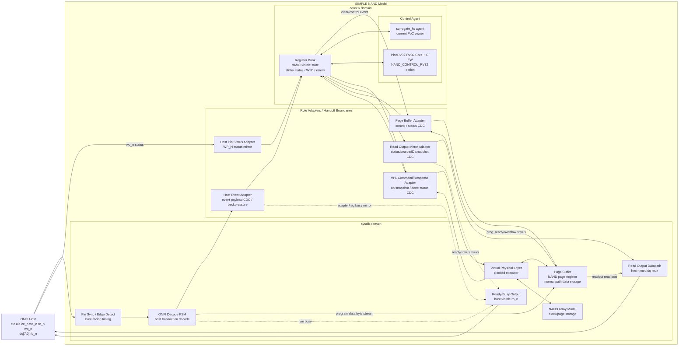

# NAND Model Architecture
Version: v0.26
Status: active

## 1. 문서 목적

본 문서는 SIMPLE NAND model의 상위 architecture overview를 정의한다. 목적은
구현 세부를 모두 설명하는 것이 아니라, 프로젝트가 어떤 방향으로 확장되는지,
block들이 어떤 순서와 책임으로 연결되는지, 그리고 각 기술적 선택의 상세 설명이
어느 문서에 있는지를 빠르게 찾게 하는 것이다.

이 문서에서 제시하는 기준 구현 흐름은 다음과 같다.

```text
Host -> Decode FSM -> Adapter/Register Bank -> Control Agent
     -> Page Buffer/VPL -> NAND Array/Read Output
```

Control Agent는 기본 PoC 빌드에서는 `surrogate_fw` agent가 맡고,
`NAND_CONTROL_RV32` 빌드에서는 같은 register/MMIO 계약을 유지한 채
`PicoRV32 RV32 Core + C FW`가 맡는다.

## 2. 프로젝트 방향성

NAND model의 목적은 완전한 analog NAND 구현이 아니라, Host-visible ONFI SDR
transaction을 받아 FW-controlled VPL operation으로 연결하는 PoC를 만드는 것이다.

프로젝트 방향은 아래 순서를 기준으로 한다.

1. Host ONFI traffic을 Decode FSM이 해석한다.
2. Decode 결과와 data path를 Adapter/Register Bank/Page Buffer 계약으로 분리한다.
3. `surrogate_fw` agent로 RV32 Core + FW 동작을 먼저 모사한다.
4. smoke/regression으로 control contract와 VPL 동작을 검증한다.
5. 검증된 register/MMIO 계약을 유지한 채 실제 RV32 Core + FW control-agent path를
   통합한다.

PicoRV32 관련 원칙과 세부 구조는 NAND repo 내부 vendored core와
`nand_picorv32.md`를 기준으로 한다. PicoRV32 core 자체의 세부 interface와
NAND Register Bank MMIO bridge는 이 문서에 반복하지 않고 `nand_picorv32.md`로
라우팅한다.

## 3. Top-Level Block Diagram



`surrogate_fw` agent와 `PicoRV32 RV32 Core + FW`는 동시에 functional owner가 아니다.
기본 RTL build에서는 `surrogate_fw` agent가 control agent이고,
`NAND_CONTROL_RV32` build에서는 `nand_rv32_control_agent`가 PicoRV32 native bus를
Register Bank `cpu_*` MMIO slot에 연결한다.

현재 RTL file 구조에서는 `nand_logic_top`이 Decode Frontend, role adapters,
Page Buffer, Register Bank, VPL executor, control agent를 함께 instance한다. Public
top interface는 clock/reset과 ONFI host-facing pin(`cle`, `ale`, `ce_n`, `we_n`,
`re_n`, `wp_n`, bidirectional `dq[7:0]`, `rb_n`) 중심으로 유지한다. 내부 status,
debug, VPL command/response, Page Buffer monitor signal은 top public port로
늘리지 않고, 필요 시 TB hierarchical reference 또는 별도 debug interface로 다룬다.
Register Bank의 `cpu_*` MMIO bus는 top 내부 wire이며, control agent 선택 구간에서
하나의 owner만 이를 구동한다. RV32 build에서는 `fw/` 아래 C firmware image를
RV32 agent-local SRAM에 load하고, FW가 IRQ enable MMIO 초기화를 끝냈다는
`control_ready` indication이 sysclk domain으로 mirror될 때까지 top이 host-facing
`rb_n`과 Decode FSM backpressure를 busy 상태로 유지한다. VPL은 기본 빌드에서
`nand_vpl_executor` clocked executor가 담당한다.

## 4. Architecture Overview

Top-level architecture는 host-facing decode path, control/status path, data path,
operation executor를 분리한다. 이 분리는 FW latency, shared resource race,
RV32 control-agent integration, clock-domain boundary를 다루기 위한 기본 구조다.

Adapter는 단순 배선 wrapper가 아니라 CDC-safe handoff boundary다. 초기 PoC에서
일부 block을 같은 clock에 연결할 수는 있지만, 이는 integration 선택일 뿐이다.
Architecture contract는 처음부터 sysclk domain과 coreclk domain이 분리될 수
있다고 보고, multi-bit payload와 event는 adapter의 valid/ack 또는 동등한
CDC-safe protocol을 통해 넘긴다.
Host Event Adapter, Host Pin Status Adapter, Read Output Mirror Adapter,
VPL Command/Response Adapter, Page Buffer Adapter는 역할 이름이며, CDC handoff는
가능한 한 parameterized reusable adapter primitive를 instance하여 구현한다.
Architecture diagram에서 adapter는 특정 clock domain 내부 block이 아니라
source/destination endpoint logic과 CDC-safe handoff를 묶는 role boundary로
표현한다.
단, Decode FSM과 Page Buffer는 같은 sysclk domain에 두는 것을 기준 구조로
삼기 때문에 2048-byte program data stream은 CDC adapter를 거치지 않고 sysclk-local
direct stream으로 Page Buffer에 전달한다. Page Buffer Adapter는 Register Bank와
Page Buffer 사이의 clear/control/status 같은 작은 event/status handoff를 담당한다.

Reset 이후 Control Agent가 Register Bank IRQ/MMIO 초기화를 끝내기 전까지 top은
host-facing ready를 열지 않는다. 기본 surrogate path는 즉시 ready이고, RV32 path는
FW가 `REG_IRQ_ENABLE`을 설정한 뒤 ready로 전환된다.

기준 흐름:

1. Host command/address/data 입력은 Pin Sync / Edge Detect와 ONFI Decode FSM에서
   host transaction event로 해석된다.
2. Decode FSM은 command/address/data phase를 해석해 command/address 기반 event를
   Host Event Adapter로 넘긴다. Program data byte stream은 같은 sysclk domain의
   Page Buffer write path로 직접 전달해 bulk data throughput을 유지한다.
3. Host Event Adapter는 accepted event와 address snapshot을 CDC-safe payload로
   Register Bank domain에 atomic하게 commit한다. 이 시점부터 FSM/Adapter는 필요한
   경우 busy 또는 backpressure 상태를 유지해 같은 resource에 대한 새 host
   transaction을 막는다.
4. Register Bank는 event mailbox/status를 갱신하고 IRQ를 assert한다. IRQ pending,
   enable/mask, W1C clear 같은 FW-visible interrupt policy는 Register Bank 책임이다.
5. `surrogate_fw` 또는 RV32 FW는 IRQ를 보고 Register Bank의 event mailbox와 target
   register를 읽어 다음 control step을 결정한다.
6. Control Agent는 decoded event를 Read ID/Status/Page, Program, Erase 등 필요한
   operation으로 변환하고 VPL opcode/start를 설정한다.
7. VPL Command/Response Adapter는 Register Bank의 opcode/address/option을
   snapshot으로 묶어 sysclk domain의 VPL에 넘기고, VPL done/error/status를 다시
   coreclk domain의 Register Bank로 돌려준다.
8. VPL은 trigger 시점 snapshot을 기준으로 NAND Array Model과 Page Buffer를 갱신한다.
   Page Buffer 접근과 freeze/count/prog_ready/overflow 관리는 sysclk-local Page Buffer
   side에서 처리하고, Register Bank와 필요한 clear/status event만 Page Buffer Adapter를 통해
   crossing한다.
9. FW는 VPL completion과 status를 확인한 뒤 필요한 W1C clear 또는 next-ready update를
   수행한다.
10. FSM/Adapter는 Register Bank/VPL status를 기준으로 busy/backpressure를 해제하고
   다음 host transaction을 받을 수 있는 상태로 돌아간다.
11. Read Output Datapath는 sysclk domain에 준비된 ID address/status/source snapshot과
    Page Buffer data를 Host `re_n` traffic에 맞춰 출력한다.

이 구조에서 IRQ를 FW/Core에 보이는 interrupt contract로 만드는 책임은 Register
Bank에 있고, host command를 받을지 막을지 결정하는 busy/backpressure 책임은 Decode
FSM과 Host Event Adapter에 있다. 두 책임을 분리해 Decode FSM이 protocol decode와
host-facing flow control에 집중하고, Register Bank가 FW-visible event/IRQ/W1C
정책을 관리하게 한다.

## 5. Clock Domain Policy

기준 clock 구성은 host-visible timing path와 FW/MMIO control path를 분리한다.

| Domain | 기준 clock | 포함 block | 이유 |
| --- | --- | --- | --- |
| Sys/data domain | `sys_clk` | Pin Sync / Edge Detect, Decode FSM, Page Buffer, Read Output Datapath, VPL executor | ONFI `we_n/re_n` sampling, program data input, read data output, page buffer 접근을 host timing에 가깝게 유지한다. |
| Control/MMIO domain | `coreclk` | RV32 Core/FW, Register Bank, FW-visible IRQ/W1C/status register | RV32 integration과 MMIO timing을 host pin timing에서 분리한다. |
| Handoff / CDC boundary | source/destination clock pair | Host Event Adapter, Host Pin Status Adapter, Page Buffer Adapter, VPL Command/Response Adapter, Read Output Mirror Adapter, optional FW debug Page Buffer access | multi-bit payload coherency와 event loss 방지를 adapter contract로 관리한다. |

Adapter role은 source domain endpoint, destination domain endpoint, CDC primitive를
필요한 만큼 포함할 수 있다. 따라서 top-level integration은 adapter role을 하나의
handoff boundary로 instance하고, 세부 payload packing/CDC primitive 선택은
`nand_adapter_contracts.md`를 따른다.

Page Buffer는 NAND 관점에서 host I/O와 array operation 사이의 page register/data
register에 가깝다. 따라서 기준 구조에서는 Page Buffer와 Read Output Datapath를
sysclk domain에 둔다. Host `re_n`에 반응해 `dq`를 drive하는 마지막 경로는
FW, RV32, Register Bank CDC latency를 직접 포함하지 않고, 미리 준비된 sysclk-local
snapshot과 Page Buffer data만 사용한다.
Program data write path도 같은 원칙을 따른다. Decode FSM과 Page Buffer가 같은
sysclk domain에 있으므로 2048-byte page data는 CDC adapter나 coreclk Register
Bank를 통과하지 않는다. 다른 clock 구성으로 확장해야 하는 경우에는 별도 stream
adapter 또는 async FIFO를 새로 검토한다.

Register Bank가 coreclk domain에 있으므로 Read Output Datapath가 필요한 status
byte, output source select, Read ID address snapshot, ID/status/read-page mode 같은
정보는 Read Output Mirror Adapter가 coreclk에서 sysclk로 snapshot 또는 mirror한다.
단일 bit level은 level sync를 사용할 수 있지만, multi-bit status/source bundle은
valid/ack snapshot 또는 동등한 coherency protocol을 사용한다.

VPL은 기준 구조에서 sysclk domain의 clocked executor로 둔다. READ/PROGRAM/ERASE는
array/page buffer write, busy/done/error state, latency counter, resource handoff를
포함하므로 순수 combinational block으로 두지 않는다. 주소 계산, mask 생성, status
decode 같은 작은 helper logic은 조합회로일 수 있지만, operation start/done과
array/page buffer commit은 clocked boundary에서 일어난다.

## 6. Block Responsibility

| Block | 책임 |
| --- | --- |
| Host Pin Sync / Edge Detect | 비동기 ONFI pin을 모델 clock에 맞춰 sample하고 `we_n`, `re_n` edge event를 만든다. |
| Decode FSM | command/address/data phase를 해석해 host transaction event를 만들고, program data byte stream은 같은 sysclk domain의 Page Buffer write path로 직접 전달한다. 내부 state 구성과 세부 전환은 Decode FSM 설계 문서를 따른다. |
| Host Event Adapter | sysclk domain의 decoded event와 address snapshot을 Register Bank coreclk domain으로 CDC-safe하게 atomic commit한다. busy/backpressure, event valid/ready, payload stability, Register Bank handoff 기준을 관리하고 Register Bank busy mirror를 sysclk host-facing lockout으로 되돌린다. |
| Host Pin Status Adapter | host-facing `wp_n` 같은 pin status를 coreclk Register Bank가 사용할 수 있는 status mirror로 넘긴다. Top public port에는 physical host pin만 남기고, core-domain 보호 상태 생성은 adapter 내부 책임으로 둔다. |
| Register Bank | FW/Core가 보는 MMIO state, decoded event mailbox, opcode/target/status/error/IRQ, sticky/W1C side effect를 관리한다. Host Event Adapter handoff 이후 Control Agent가 다음 작업을 시작하는 기준점이다. |
| Control Agent | Decode event를 읽고 address를 block/page/column으로 변환한 뒤 VPL opcode/start를 설정한다. Surrogate FW와 RV32 FW는 같은 Register Bank MMIO/IRQ contract를 사용하며, RV32 path는 FW 초기화 완료 indication으로 host ready gate를 연다. |
| VPL Command/Response Adapter | coreclk Register Bank의 opcode/address/option snapshot을 sysclk VPL로 넘기고, sysclk VPL의 done/error/status를 coreclk Register Bank로 반환한다. |
| Page Buffer Adapter | coreclk Register Bank와 sysclk Page Buffer 사이의 clear/control event와 prog_ready/overflow/status mirror를 CDC-safe하게 전달한다. 2048-byte program data stream은 이 adapter를 통과하지 않는다. |
| Page Buffer | sysclk domain에서 Program source 또는 Read destination으로 쓰이는 data path storage다. 현재 RTL의 program stream, VPL direct read/write port, Read Output direct read port, count/freeze/status 계약은 Page Buffer 설계 문서를 따른다. |
| VPL | sysclk domain clocked executor로 동작하며 register snapshot을 받아 internal array와 Page Buffer direct port를 갱신하고 busy/done/error/status를 반환한다. |
| Read Output Mirror Adapter | coreclk Register Bank의 output source/status/Read ID address 정보를 sysclk Read Output Datapath가 사용할 수 있는 snapshot 또는 mirror로 넘긴다. |
| Read Output Datapath | sysclk domain에서 `re_n` 토글에 맞춰 ID/status/page buffer data를 host로 출력한다. `re_n` to `dq` 경로에 FW/coreclk CDC latency를 직접 넣지 않는다. 세부 RTL 계약은 `nand_read_output_datapath.md`를 따른다. |

## 7. Architecture Decisions and Detail Index

Architecture 문서는 기술 선택의 목적과 문서 위치만 정리한다. 세부 field,
state, timing, checker, CDC rule은 아래 상세 문서를 따른다.

| 목적 또는 방지하려는 문제 | 사용하는 구조/기술 | 상세 문서 |
| --- | --- | --- |
| Host-visible ONFI command 동작을 한 곳에서 고정 | SIMPLE ONFI SDR behavior model | `SIMPLE_ONFI_SDR_behavior_model_reference.md` |
| host pin timing과 내부 control/status 계약 혼동 방지 | Pin Sync / Edge Detect, ONFI Decode FSM, Host Event Adapter, Host Pin Status Adapter | `SIMPLE_ONFI_SDR_decode_fsm.md`, `nand_adapter_contracts.md`, `host_tb_traffice_scenario.md` |
| Decode FSM 이후 surrogate FW/RV32 FW가 다음 작업을 시작하는 기준 확보 | Host Event Adapter, Register Bank event mailbox, IRQ/status handoff, W1C clear | `nand_adapter_contracts.md`, `nand_register_bank.md`, `nand_control_fw.md`, `SIMPLE_ONFI_SDR_decode_fsm.md` |
| FW latency가 ONFI program/read data path를 막는 문제 방지 | sysclk-local Page Buffer data path와 Register Bank/Page Buffer control-status adapter 분리 | `nand_page_buffer.md`, `nand_adapter_contracts.md`, `nand_model_vpl.md` |
| Read output timing path에 FW/CDC latency가 들어가는 문제 방지 | sysclk Read Output Datapath와 coreclk-to-sysclk status/source/ID snapshot mirror | `nand_read_output_datapath.md`, `nand_adapter_contracts.md`, `nand_register_bank.md`, `nand_cdc_ip.md` |
| surrogate FW와 RV32 FW 교체 가능성 확보 | 동일한 Register Bank/MMIO/control contract | `nand_register_bank.md`, `nand_control_fw.md`, `nand_picorv32.md` |
| VPL operation 중 live register 변경으로 생기는 race 방지 | VPL Command/Response Adapter와 trigger 시점 register snapshot | `nand_adapter_contracts.md`, `nand_model_vpl.md`, `nand_register_bank.md`, `nand_control_fw.md`, `nand_cdc_ip.md` |
| 초기부터 clock domain 분리 계약 유지 | Adapter-owned valid/ack CDC boundary와 payload snapshot | `nand_adapter_contracts.md`, `nand_cdc_ip.md` |
| 외부 RTL FSM과 RV32 control path 연결 기준 확보 | external event adapter / role adapter 구조 | `nand_adapter_contracts.md`, `nand_cdc_ip.md` |
| PicoRV32 native bus/MMIO/IRQ 연결 기준 확보 | NAND PicoRV32 integration 문서 참조 | `nand_picorv32.md` |
| Read/Program/Erase가 cell-level 의미와 어긋나는 문제 방지 | WL/BL/bias 개념 기준과 VPL operation 의미 분리 | `nand_cell_operation.md`, `nand_model_vpl.md` |

## 8. Document Boundary

- Architecture 세부 설명은 이 문서에 길게 복사하지 않는다.
- command set과 host-visible behavior는 `SIMPLE_ONFI_SDR_behavior_model_reference.md`를 따른다.
- Decode FSM state, event timing, host traffic expectation은
  `SIMPLE_ONFI_SDR_decode_fsm.md`와 `host_tb_traffice_scenario.md`를 따른다.
- Decode FSM event handoff, Host Event Adapter, Host Pin Status Adapter,
  Page Buffer Adapter, VPL Command/Response Adapter, Read Output Mirror
  Adapter, adapter-owned CDC boundary contract는
  `nand_adapter_contracts.md`와 `nand_cdc_ip.md`를 따른다.
- FW/MMIO register map, offset, bitfield, IRQ/status/W1C는
  `nand_register_bank.md`를 따른다.
- Read ID/Status/Page Buffer source를 host `re_n`에 맞춰 `dq_out`으로 내보내는
  datapath 계약은 `nand_read_output_datapath.md`를 따른다.
- Control FW/surrogate FW flow와 RV32 FW handoff는 `nand_control_fw.md`를 따른다.
- Clock domain policy와 top-level CDC boundary는 본 문서를 우선하고, 각 adapter의
  payload/handshake 세부 계약은 `nand_adapter_contracts.md`를 따른다.
- Page Buffer RTL ownership과 현재 구현 범위는 `nand_page_buffer.md`를 따른다.
- Page Buffer adapter handoff와 VPL operation은 `nand_adapter_contracts.md`와
  `nand_model_vpl.md`를 따른다.
- PicoRV32 core attach, native bus MMIO, firmware image, IRQ/FW-ready 계약은
  `nand_picorv32.md`를 따른다.

---

## Version History

| Version | Description |
| --- | --- |
| v0.26 | 남아 있던 PicoRV32 외부 경로 참조 표현을 NAND repo 내부 vendored core와 `nand_picorv32.md` 기준으로 정정. |
| v0.25 | PicoRV32/CDC IP vendored source 전환에 맞춰 detail index와 document boundary를 `nand_picorv32.md`, `nand_cdc_ip.md` 중심으로 갱신. |
| v0.24 | 구현 완료 상태에 맞춰 RV32 integration 표현을 현재 RV32 control-agent integration 기준으로 정리하고 문서 status를 active로 갱신. |
| v0.23 | 삭제된 Page Buffer CDC/timing 참고 노트 참조를 current document boundary에서 제거. |
| v0.22 | `NAND_CONTROL_RV32` RV32 control-agent option, C FW image path, FW-ready 기반 host-ready gate를 현재 RTL 구조로 반영. |
| v0.21 | `nand_logic_top` public interface를 host pin 중심으로 정리하고 bidirectional `dq`, `rb_n`, Host Pin Status Adapter, adapter-owned busy mirror 기준을 반영. |
| v0.20 | Read Output Datapath RTL 구현에 맞춰 Read ID address mirror와 Page Buffer readout direct read port를 반영. |
| v0.19 | Page Buffer VPL direct port와 VPL executor internal array/read/program/erase 구현 범위를 block responsibility에 반영. |
| v0.18 | 기본 top에 `nand_vpl_executor` clocked executor를 붙이고 당시 외부 VPL/debug hook 선택 기준을 반영. |
| v0.17 | `nand_logic_top` 단일 top 내부에서 surrogate/RV32 control-agent 선택 구간을 두는 RTL 구조를 반영. |
| v0.16 | 현재 RTL의 `nand_logic_core`/`nand_logic_top` 분리와 `surrogate_fw` agent ownership을 반영. |
| v0.15 | Page Buffer RTL 상세 계약 문서 `nand_page_buffer.md`를 detail index/document boundary에 추가하고 owner 표현을 현재 RTL 범위에 맞춰 정리. |
| v0.14 | `host/sysclk` 표현을 `sysclk`로 통일하고 block diagram의 direct-path label을 단순화. RTL public clock naming을 `sys_clk`/`core_clk` 기준으로 반영. |
| v0.13 | Program data byte stream은 Decode FSM/Page Buffer sysclk direct path로 두고 Page Buffer Adapter는 Register Bank/Page Buffer control-status handoff로 한정. |
| v0.12 | Top-level block diagram에서 Page Buffer Adapter를 role adapter/handoff boundary로 이동하고 clock domain policy를 adapter contract 기준으로 정리. |
| v0.11 | `nand_adapter_contracts.md` 승격에 맞춰 adapter detail index와 document boundary를 갱신. |
| v0.10 | Adapter 역할 이름과 parameterized reusable adapter primitive 구현 원칙을 명시. |
| v0.9 | Register Bank 상세 MMIO contract를 `nand_register_bank.md`로 분리한 문서 경계를 반영. |
| v0.8 | 기준 clock domain policy를 추가하고 Page Buffer/Read Output/VPL/adapter CDC boundary를 top-level diagram과 책임 표에 반영. |
| v0.7 | Adapter가 처음부터 CDC-safe boundary를 보유한다는 architecture contract를 명시하고 single-clock PoC 설명의 우선순위를 정리. |
| v0.6 | 외부 architecture 문서에서는 내부 sub-block 나열을 줄이고 Decode FSM 단일 block 명칭으로 정리. |
| v0.5 | Host Event/Data Adapter 문서를 canonical handoff contract로 추가하고 page_buffer_cdc_timing_design_note.md를 참고 노트로 격하. |
| v0.4 | Architecture overview 기준 흐름에 Register Bank IRQ ownership, FSM/Adapter busy 유지, FW/VPL completion handoff를 보강. |
| v0.3 | Decode FSM에서 Register Bank/Page Buffer Adapter로 handoff하고 IRQ로 Control Agent를 시작하는 흐름을 명확히 정리. |
| v0.2 | Architecture 문서 목적과 프로젝트 방향성을 명확히 하고, 세부 기술 설명을 detail index 중심으로 정리. |
| v0.1 | PicoRV32 integration 문서 원칙을 참조해 NAND model 상위 architecture와 surrogate/RV32 FW 교체 경로를 정리. |
