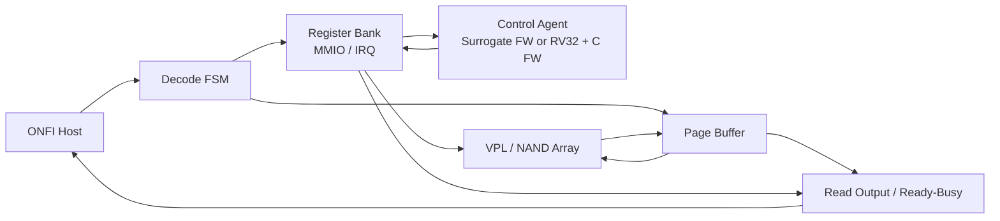

# Project Introduction
Version: v0.1
Status: active

이 프로젝트의 목적은 ONFI host transaction을 단순 behavioral model로만 처리하지 않고,
실제 controller/SoC에 가까운 구조로 분해해 검증하는 것이다.

핵심 PoC는 아래 질문에 답하는 데 있다.

- Host-facing ONFI SDR pin transaction을 HW Decode FSM이 안정적으로 event로 만들 수 있는가?
- HW event와 FW control flow를 Register Bank, MMIO, IRQ 경계로 명확히 분리할 수 있는가?
- Surrogate FW로 먼저 검증한 control flow를 실제 PicoRV32 + C FW path로 교체해도 같은 구조가 유지되는가?
- Page Buffer, VPL(Virtual Physical Layer, NAND Cell과 그 Layer 를 PoC를 위해 간단하게 모델링한 것), Read Output Datapath를 통해 Program/Read/Erase 동작이 end-to-end로 관측되는가?

즉, 이 repository는 단순 NAND memory array model이 아니라, NAND-like target을 대상으로
한 RV32-assisted logic/controller architecture PoC다.

## Top-Level Idea

