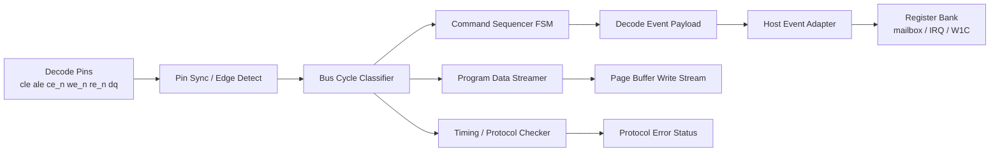
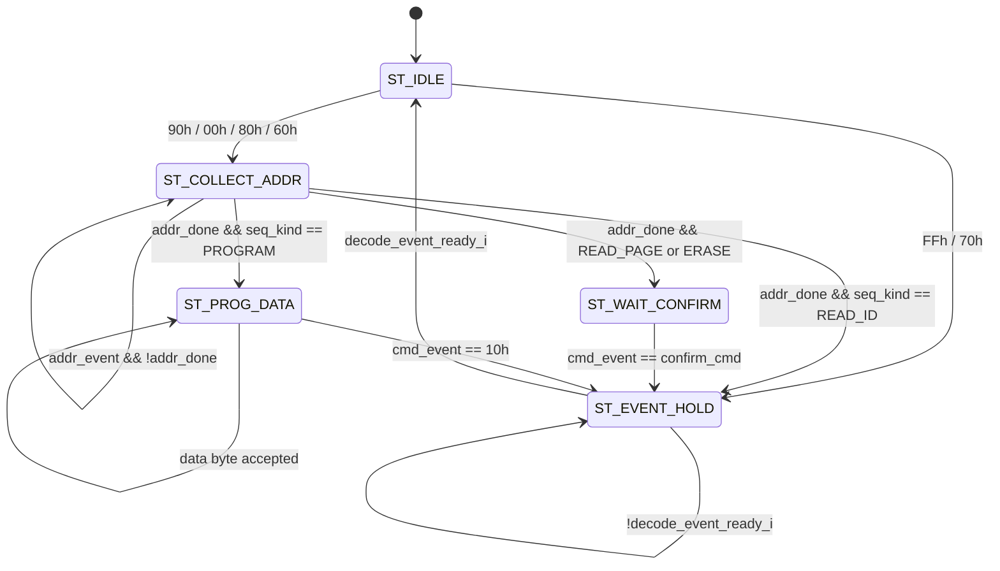
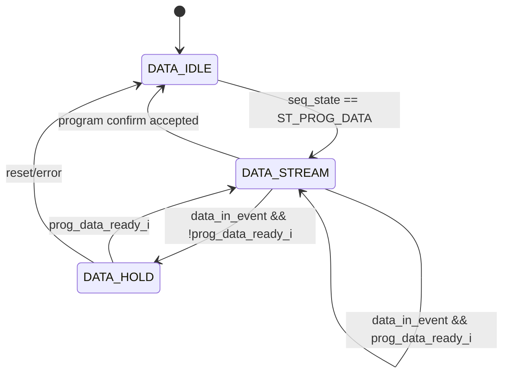

# SIMPLE ONFI SDR Decode FSM Design
Version: v0.19

본 문서는 `SIMPLE_ONFI_SDR_behavior_model_reference.md`의 지원 command를 NAND
Model 내부에서 해석하기 위한 합성 가능한 decode FSM 설계 기준을 정의한다.

본 문서에서 Decode FSM은 단일 state machine만 뜻하지 않는다. 외부 문서 명칭은
Decode FSM으로 유지하되, RTL 구현은 범용 `pin_sync_edge_detect`를 frontend에서
integration하고, `onfi_sdr_decode_fsm`은 synchronized pin-level signal을 받아
내부에서 ONFI bus event를 classify하는 구조로 분리한다.

이 문서의 핵심 방향은 큰 FSM 하나에 모든 command 전이를 펼치지 않는 것이다.
ONFI pin traffic decode, command sequence 추적, program data streaming, timing
check, adapter handoff를 작게 분리해 RTL 구현과 debug를 단순하게 만든다.
FSM 코딩 스타일은 `FSM_RTL_Design_Guide.md`를 따른다.

Decode FSM은 FW-visible IRQ를 직접 만들지 않는다. transaction decode 완료
event를 Host Event Adapter로 넘기고, Register Bank가 event mailbox/status를
갱신한 뒤 IRQ/W1C policy를 처리한다. Adapter/CDC/Register Bank handoff는
`nand_adapter_contracts.md`, `nand_cdc_ip.md`, `nand_register_bank.md`를 따른다.

## 1. Behavior Reference 요약

지원 command와 host-visible sequence는
`SIMPLE_ONFI_SDR_behavior_model_reference.md`를 따른다.

| Command | Host sequence | Decode 완료 시점 | 비고 |
| --- | --- | --- | --- |
| Reset | `FFh` | `FFh` command latch | Busy 중에도 허용 |
| Read ID | `90h + 1 address` | 1 address byte latch | address `00h` 또는 `20h` |
| Read Status | `70h` | `70h` command latch | Busy 중에도 허용, 반복 `re_n` polling 가능 |
| Read Page | `00h + C1 C2 R1 R2 R3 + 30h` | `30h` confirm latch | address 5 byte |
| Page Program | `80h + C1 C2 R1 R2 R3 + data + 10h` | `10h` confirm latch | data length는 confirm 전까지 open |
| Block Erase | `60h + R1 R2 R3 + D0h` | `D0h` confirm latch | address 3 byte |

Read/Page Program address는 `C1, C2, R1, R2, R3` 5 cycle이고, Block Erase
address는 `R1, R2, R3` 3 cycle이다. Decode FSM은 address byte를 원본
그대로 snapshot으로 넘기며, block/page/column 계산은 Control Agent 또는 별도
address decoder가 수행한다.

## 2. 분해 구조

Decode FSM은 아래 sub-block으로 나눈다.



| Block | 책임 |
| --- | --- |
| Pin Sync / Edge Detect | decode에 필요한 host pin을 `sys_clk`에 동기화하고 `we_rise`, `re_fall`, `re_rise`를 만든다. `re_fall/re_rise`는 Read Output Datapath용으로 frontend 밖에 노출한다. |
| Bus Cycle Classifier | `ce_n`, `cle`, `ale`, `we_rise`를 기준으로 command/address/data input event를 분류한다. |
| Command Sequencer FSM | command context, address count, confirm command 대기, decode event 생성만 담당한다. |
| Program Data Streamer | Program data byte를 같은 sysclk domain의 Page Buffer write valid/ready stream으로 전달하고 count를 유지한다. |
| Timing / Protocol Checker | `tWC`, `tADL`, invalid bus, unexpected phase 같은 write-side violation을 sticky error로 남긴다. read-output timing guard는 Read Output Datapath/TB 계약을 따른다. |
| Host Event Adapter | decode event payload를 Register Bank mailbox에 atomic commit한다. |

이 분해의 의도는 Command Sequencer FSM 상태 수를 command 개수에 비례해 늘리지
않는 것이다. Read Page, Program, Erase의 차이는 state가 아니라 context register와
command table로 처리한다.

## 3. External Port Contract

권장 RTL 분할:

```text
decode-related ONFI pins
  -> pin_sync_edge_detect
  -> frontend synchronized pin-level handoff
  -> onfi_sdr_decode_fsm
     -> Host Event Adapter
     -> Page Buffer write path
```

`pin_sync_edge_detect`는 ONFI 의미를 모르는 범용 IP다. `cle/ale/ce_n/we_n/dq`
조합으로 command/address/data input event를 만드는 일은 Decode FSM 내부 Bus Cycle
Classifier가 담당한다. `re_n` edge는 frontend가 동기화해 Read Output Datapath로
전달하며, Decode FSM core input으로 넘기지 않는다. `wp_n`은 command decode event가
아니라 live pin status이므로 Host Pin Status Adapter가 Register Bank domain으로
mirror한다.

Decode FSM core 권장 port 형태:

```verilog
module onfi_sdr_decode_fsm (
    input  wire       sys_clk,
    input  wire       sys_rst_n,

    input  wire [7:0] dq_sync_i,
    input  wire       cle_sync_i,
    input  wire       ale_sync_i,
    input  wire       ce_n_sync_i,
    input  wire       we_rise_i,

    input  wire       host_busy_i,
    input  wire       decode_event_ready_i,
    input  wire       prog_data_ready_i,

    output reg        decode_event_valid_o,
    output reg  [3:0] decoded_op_o,
    output reg  [7:0] cmd_o,
    output reg  [7:0] addr0_o,
    output reg  [7:0] addr1_o,
    output reg  [7:0] addr2_o,
    output reg  [7:0] addr3_o,
    output reg  [7:0] addr4_o,
    output reg  [2:0] addr_count_o,
    output reg [12:0] prog_data_count_o,

    output reg        prog_data_valid_o,
    output reg  [7:0] prog_data_o,

    output reg        protocol_error_o,
    output reg  [3:0] protocol_error_code_o,
    output reg        fsm_busy_o,
    output reg  [2:0] seq_state_o
);
```

`dq_sync_i`, `cle_sync_i`, `ale_sync_i`, `ce_n_sync_i`는 `sys_clk`
domain으로 동기화된 pin-level signal이다. `we_rise_i`는 동일 domain의 1-cycle
write edge pulse다. Decode FSM은 `we_rise_i` cycle의 synchronized
`cle/ale/ce_n/dq` 조합을 보고 내부 `cmd_event`, `addr_event`, `data_in_event`,
`invalid_bus_event`를 만든다.

`decode_event_valid_o`와 payload는 Host Event Adapter가
`decode_event_valid_o && decode_event_ready_i`로 accept할 때까지 유지한다.
`prog_data_valid_o`와 `prog_data_o`는 Page Buffer write path가
`prog_data_valid_o && prog_data_ready_i`로 accept한 byte만 count한다.

## 4. Bus Cycle Classifier

| 조건 | Event | 의미 |
| --- | --- | --- |
| `cle=1`, `ale=0` | `cmd_event` | `dq_in`을 command byte로 latch |
| `cle=0`, `ale=1` | `addr_event` | `dq_in`을 address byte로 latch |
| `cle=0`, `ale=0` | `data_in_event` | Program data byte candidate |
| `cle=1`, `ale=1` | `invalid_bus_event` | protocol error |

`ce_n_sync == 1`이면 write event는 무시한다. Read output은 별도 datapath가
frontend의 `re_fall/re_rise` pulse와 Register Bank의 `REG_READOUT_CTRL` mirror를
사용한다. Decode FSM은 readout source mode를 직접 출력하지 않는다.

## 5. Command Table

Command Sequencer는 `ST_IDLE`에서 command byte를 보고 아래 context를 load한다.

| Command | Action | `seq_kind` | `addr_target` | `confirm_cmd` | event op |
| --- | --- | --- | ---: | --- | --- |
| `FFh` | immediate event | `SEQ_NONE` | 0 | none | `OP_RESET` |
| `90h` | collect ID address | `SEQ_READ_ID` | 1 | none | `OP_READ_ID` |
| `70h` | immediate event | `SEQ_NONE` | 0 | none | `OP_READ_STATUS` |
| `00h` | collect page address | `SEQ_READ_PAGE` | 5 | `30h` | `OP_READ_PAGE` |
| `80h` | collect program address | `SEQ_PROGRAM` | 5 | `10h` | `OP_PROGRAM` |
| `60h` | collect erase row address | `SEQ_ERASE` | 3 | `D0h` | `OP_ERASE` |
| other | error or unsupported event | `SEQ_NONE` | 0 | none | `OP_UNSUPPORTED` |

`seq_kind`, `addr_target`, `confirm_cmd`, `decoded_op_pending`을 context register로
두면 command별 address state를 별도로 만들 필요가 없다.

권장 operation encoding:

```verilog
localparam [3:0] OP_NONE        = 4'd0;
localparam [3:0] OP_RESET       = 4'd1;
localparam [3:0] OP_READ_ID     = 4'd2;
localparam [3:0] OP_READ_STATUS = 4'd3;
localparam [3:0] OP_READ_PAGE   = 4'd4;
localparam [3:0] OP_PROGRAM     = 4'd5;
localparam [3:0] OP_ERASE       = 4'd6;
localparam [3:0] OP_UNSUPPORTED = 4'd15;
```

## 6. FSM Type and RTL Style

`onfi_sdr_decode_fsm`은 registered-output hybrid FSM으로 구현한다.
이 판단의 기준은 `FSM_RTL_Design_Guide.md`의 Moore/Mealy/registered-output hybrid
분류다.

Decode FSM은 순수 Moore FSM으로 두기 어렵다. `ST_IDLE`에서 같은 state에 있더라도
`dq=70h`이면 Read Status event, `dq=90h`이면 Read ID sequence, `dq=80h`이면 Program
sequence를 시작해야 한다. 즉 다음 state와 다음 payload는 현재 state뿐 아니라
`cmd_event`, `addr_event`, `data_in_event`, `dq_sync_i`, `host_busy_i`,
`prog_data_ready_i` 같은 입력을 함께 보고 결정한다. 이 점은 Mealy 성격이다.

하지만 외부 adapter가 보는 `decode_event_valid_o`, `decoded_op_o`, `cmd_o`,
`addr0_o..addr4_o`, `prog_data_valid_o`, `prog_data_o`, `protocol_error_o`는
combinational input path로 흔들리면 안 된다. `valid && ready` handoff 전까지
payload가 stable해야 하고, CDC adapter source payload도 ack 전까지 유지되어야 한다.
따라서 외부 출력은 register에 저장한다. 이 점 때문에 registered-output hybrid가
Decode FSM의 기본 구현 타입이다.

| Sub-block | 구현 타입 | 근거 |
| --- | --- | --- |
| Bus Cycle Classifier | combinational event decoder | sync된 `cle/ale/ce_n/we_rise/dq`를 command/address/data event로만 분류하며 state를 갖지 않는다. |
| Command Sequencer | binary-encoded registered-output hybrid FSM | state transition은 input event를 보지만, event payload는 clock edge에서 register한다. |
| Program Data Streamer | valid/ready hold register 기반 mini-FSM | 별도 state encoding 대신 `prog_data_valid_q`가 DATA_HOLD 상태를 표현한다. count는 accept 때만 증가한다. |
| Timing / Protocol Checker | error request producer | transition owner가 아니며, violation을 우선순위가 명시된 error event로 변환한다. |
| Host Event Handoff | registered valid/payload hold | adapter ready 전까지 payload를 안정적으로 유지한다. |

각 sub-block 판단 근거:

- Bus Cycle Classifier는 `we_rise_i && !ce_n_sync_i`인 cycle에서 `cle/ale` 조합을
  command/address/data/invalid event로 분류할 뿐이다. 과거 history가 필요 없으므로
  state register가 필요 없는 combinational decoder다.
- Command Sequencer는 address byte count, confirm command 대기, program data phase
  진입처럼 과거 context를 기억해야 한다. 따라서 stateful FSM이다.
- Program Data Streamer는 full state encoding을 따로 두지 않고
  `prog_data_valid_q`가 "data byte를 Page Buffer write path accept 전까지 hold 중"이라는
  상태를 표현한다. 그래서 mini-FSM 또는 hold register로 취급한다.
- Timing/Protocol Checker는 정상 transition을 직접 소유하지 않는다. 위반 조건을
  error event request로 만들고, 우선순위에 따라 Command Sequencer의 정상 transition
  앞에서 처리한다.
- Host Event Handoff는 `decode_event_valid_q`와 payload register가 `ST_EVENT_HOLD`
  동안 유지되는 구조다. 이 부분은 adapter contract와 직접 연결된다.

RTL 구조:

- `state_q/state_d`와 context `*_q/*_d`를 사용한다.
- sequential block은 reset과 `*_q <= *_d` 업데이트 중심으로 유지한다.
- combinational block은 default-hold 후 state별 변경점만 override한다.
- helper task가 state/output register를 직접 갱신하지 않는다.
- 외부로 나가는 `decode_event_valid_o`, payload, `prog_data_valid_o`,
  `prog_data_o`는 registered output이다.
- Mealy 성격은 next-state/next-registered-output 선택에만 사용하고,
  host pin input을 외부 combinational output으로 직접 연결하지 않는다.

우선순위:

1. `ST_EVENT_HOLD`에서 adapter accept 대기
2. timing violation error event
3. 현재 state의 정상 command/address/data transition
4. 현재 state의 protocol error event
5. default recovery to `ST_IDLE`

## 7. Command Sequencer FSM

Command Sequencer는 작고 generic한 state만 가진다.

```verilog
localparam [2:0] ST_IDLE         = 3'd0;
localparam [2:0] ST_COLLECT_ADDR = 3'd1;
localparam [2:0] ST_WAIT_CONFIRM = 3'd2;
localparam [2:0] ST_PROG_DATA    = 3'd3;
localparam [2:0] ST_EVENT_HOLD   = 3'd4;
```

정상 흐름 state diagram:



예외 흐름은 state diagram에 모두 넣지 않고 정책 표로 관리한다.

| 현재 상태 | 예외 | 정책 |
| --- | --- | --- |
| any | `invalid_bus_event` | `ERR_INVALID_BUS` event 생성 후 `ST_EVENT_HOLD` |
| `ST_IDLE` | unsupported command | `ERR_UNSUPPORTED_CMD` 또는 `OP_UNSUPPORTED` event |
| `ST_COLLECT_ADDR` | address 외 event | `ERR_UNEXPECTED_ADDR` 또는 `ERR_BAD_CONFIRM` |
| `ST_WAIT_CONFIRM` | 다른 command | `ERR_BAD_CONFIRM` |
| `ST_PROG_DATA` | data/`10h` 외 event | `ERR_UNEXPECTED_DATA` 또는 `ERR_BAD_CONFIRM` |
| busy/lockout | `70h`, `FFh` 외 command | `ERR_BUSY_ILLEGAL_CMD` 또는 ignore |

Busy 중에도 `70h` Read Status와 `FFh` Reset은 허용한다. 그 외 command/address/data는
ignore 또는 error 중 하나를 선택하되, 초기 RTL 검증에서는 sticky error를 권장한다.

## 8. Program Data Streamer

Program data streaming은 `prog_data_valid_q` hold register로 표현한다.
문서상으로는 아래 mini-FSM처럼 검토한다.



규칙:

- `prog_data_valid_o`는 data byte가 stable할 때 assert한다.
- `prog_data_o`는 `prog_data_ready_i`가 돌아올 때까지 유지한다.
- `prog_data_count_o`는 `prog_data_valid_o && prog_data_ready_i`에서만 증가한다.
- `10h` confirm event payload의 `prog_data_count_o`는 Page Buffer write path가 실제
  accept한 byte 수와 일치해야 한다.
- `NAND_PAGE_SIZE` 초과 write는 Page Buffer write path 또는 checker가 overflow
  error로 남긴다.

## 9. Timing / Protocol Checker

Timing checker는 Command Sequencer 상태를 바꾸는 주체가 아니다. violation을
sticky status로 남겨 debug와 검증을 쉽게 한다.

권장 checker:

| Checker | 기준 |
| --- | --- |
| `tWC` | `we_rise` 간격이 `T_WC_CYCLES`보다 작으면 `ERR_TWC` |
| `tRC` | read output block에서 `re` cycle 간격이 `T_RC_CYCLES`보다 작으면 `ERR_TRC` |
| `tADL` | Program address 완료 후 `T_ADL_CYCLES` 전 data input이면 `ERR_TADL` |
| read output guard | Read ID/Status/Page command 이후 host `re_n` timing은 Read Output Datapath TB와 host traffic scenario에서 검증 |
| busy read | Busy 완료 전 page read output 요청이면 `ERR_READ_WHILE_BUSY` |

Debug/verification 설정에서는 `CHECK_TIMING_EN` parameter로 timing checker를 끌 수
있게 하되, protocol phase checker는 유지하는 것을 권장한다.

## 10. Address 전달 규칙

Decode FSM은 address byte를 원본 그대로 전달한다.

Read Page/Page Program:

```text
addr0 = C1
addr1 = C2
addr2 = R1
addr3 = R2
addr4 = R3
addr_count = 5
```

Block Erase:

```text
addr0 = R1
addr1 = R2
addr2 = R3
addr3 = 0
addr4 = 0
addr_count = 3
```

Column/row 해석:

```verilog
col_addr = addr0 + (addr1 << 8);
row_addr = addr2 + (addr3 << 8) + (addr4 << 16);
```

Block Erase는 `row_addr = addr0 + (addr1 << 8) + (addr2 << 16)`로 해석한다.
`row_addr % NAND_TOTAL_PAGES`로 주소를 접는 방식은 range violation을 숨기므로
기본 정책으로 두지 않는다.

## 11. Output Datapath와의 분리

Decode FSM은 `dq`를 직접 drive하지 않는다.

Decode FSM이 만드는 것은 `decoded_op_o`, command/address snapshot,
program data count, protocol error를 포함한 transaction event다.

Read output source 선택은 Control Agent가 host event IRQ를 처리한 뒤
`REG_READOUT_CTRL`을 쓰는 방식으로 수행한다. Register Bank는 이 값을 Read Output
Mirror Adapter를 통해 sysclk domain으로 mirror하고, Read Output Datapath는
frontend가 제공하는 `re_fall/re_rise` pulse와 mirrored source/status/Page Buffer
data를 사용해 `dq_out`/`dq_oe`를 갱신한다.

## 12. Verification Focus

검증은 큰 FSM waveform을 눈으로 따라가는 방식이 아니라 block별 contract를 확인한다.

| 대상 | 체크 |
| --- | --- |
| Bus Cycle Classifier | `cle/ale/ce_n/we_rise` 조합이 event로 정확히 분류되는지 |
| Command Sequencer | command table에 따라 `addr_target`, `confirm_cmd`, `decoded_op` context가 load되는지 |
| Address collection | 1/3/5 byte address count와 snapshot이 정확한지 |
| Event handoff | `decode_event_valid` 동안 payload가 stable하고 ready 전까지 유지되는지 |
| Program streamer | data byte가 ready handshake 때만 count/commit되는지 |
| Busy exception | Busy 중 `70h`, `FFh`만 허용되는지 |
| Error policy | invalid bus, bad confirm, unexpected phase가 sticky error로 남는지 |
| Timing checker | `tWC`, `tADL` 같은 write-side timing/protocol 위반을 잡는지 |

필수 assertion 예:

```systemverilog
// event payload must remain stable until adapter accepts it
assert property (@(posedge sys_clk) disable iff (!sys_rst_n)
    decode_event_valid_o && !decode_event_ready_i
    |=> decode_event_valid_o && $stable({
        decoded_op_o, cmd_o, addr0_o, addr1_o, addr2_o,
        addr3_o, addr4_o, addr_count_o, prog_data_count_o,
        protocol_error_code_o
    }));

// program data count only changes on accepted bytes
assert property (@(posedge sys_clk) disable iff (!sys_rst_n)
    (prog_data_count_o != $past(prog_data_count_o))
    |-> $past(prog_data_valid_o && prog_data_ready_i));
```

## Version History

| Version | 변경사항 |
| --- | --- |
| v0.19 | Decode FSM core에서 unused `wp_n`/`re_n` input과 legacy `mode_*` output을 제거하고, readout source 선택이 Register Bank `REG_READOUT_CTRL`/Read Output Datapath 계약임을 명확히 정리. |
| v0.18 | 현재 Decode FSM debug/status port 예시를 보강하고 program data hold 설명을 Page Buffer write path accept 기준으로 정정. |
| v0.17 | Adapter/CDC/Register Bank handoff 참조를 NAND-owned `nand_cdc_ip.md`와 `nand_register_bank.md` 기준으로 갱신. |
| v0.16 | Timing checker parameter 설명을 현재 debug/verification 설정 기준으로 정리. |
| v0.15 | Diagram label을 단순화하고 외부 handoff 설명을 `sys_clk` Page Buffer write path 기준으로 정리. |
| v0.14 | Decode FSM 외부 handoff 그림을 Host Event Adapter와 sysclk-local Page Buffer write path로 분리. |
| v0.13 | Program data byte stream을 Page Buffer Adapter CDC가 아닌 sysclk-local Page Buffer write path로 명확히 정리. |
| v0.12 | Adapter contract 문서 승격에 맞춰 `nand_adapter_contracts.md` 참조를 반영. |
| v0.11 | Register Bank 상세 MMIO contract 분리에 맞춰 `nand_register_bank.md`와 PicoRV32 `register_bank.md` 참조를 반영. |
| v0.10 | 공유 파라미터 헤더 `nand_model/nand_parameters.vh` 기준으로 page size/row range macro 이름을 갱신. |
| v0.9 | `FSM_RTL_Design_Guide.md`의 범용화에 맞춰 Decode FSM 고유의 registered-output hybrid 선택 근거와 sub-block별 구현 근거를 본 문서로 이동/보강. |
| v0.8 | FSM RTL design guide를 참조하고 Decode FSM을 registered-output hybrid FSM으로 명시. sub-block별 FSM 타입, RTL 구조, priority 기준을 추가. |
| v0.7 | 범용 `pin_sync_edge_detect`를 frontend integration logic에서 사용하고 Decode FSM core는 synchronized pin-level 입력을 받아 내부에서 bus event를 classify하도록 포트 계약을 갱신. |
| v0.6 | 외부 명칭과 RTL top wrapper 이름은 Decode FSM으로 유지하고, 내부 분해 구조를 문서 정의로 명확히 정리. |
| v0.5 | 거대 command별 FSM을 Command Sequencer, Program Data Streamer, Timing/Protocol Checker 구조로 분해하고 state diagram을 단순화. |
| v0.4 | State transition diagram을 추가하고 adapter accept 대기를 위한 `ST_EVENT_HOLD` 상태를 명시. |
| v0.3 | Architecture v0.5에 맞춰 Decode FSM의 FW-visible IRQ/Register ownership을 제거하고 Host Event Adapter/Page Buffer Adapter handoff contract로 정리. |
| v0.2 | SIMPLE 고정 geometry에 따른 row address bit layout과 range-check 기반 address decode 규칙을 추가. |
| v0.1 | ONFI SDR command/address/data decode FSM의 책임, 상태, IRQ 정책, timing checker 기준을 최초 정리. |
