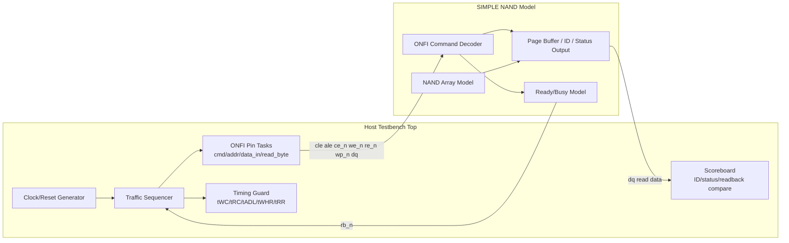
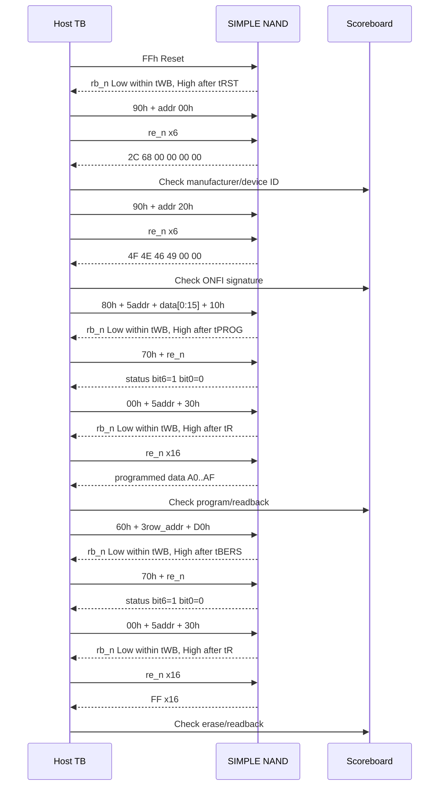

# Host TB ONFI SDR Traffic Scenario
Version: v0.6

본 문서는 `SIMPLE_ONFI_SDR_behavior_model_reference.md`를 기준으로, Host Testbench(TB)가 SIMPLE NAND 모델에 인가해야 하는 ONFI SDR Mode 0 traffic 제어 시퀀스를 정의한다. 목적은 이후 `testbench top` Verilog/SystemVerilog 작성 시 그대로 task, checker, scoreboard 구조로 옮길 수 있는 실행 시나리오를 제공하는 것이다.

> 파일명은 사용자 요청에 맞춰 `host_tb_traffice_scenario.md`로 둔다. 문서 내부 용어는 `traffic`을 사용한다.

## 1. 기준 및 범위
- 기준 문서: `SIMPLE_ONFI_SDR_behavior_model_reference.md`
- 지원 인터페이스: Legacy Async SDR, x8 `dq[7:0]`
- 지원 timing mode: SDR Timing Mode 0 only
- 필수 traffic: Reset -> Read ID 00h -> Read ID 20h -> Page Program -> Read Status -> Read Page -> Block Erase -> Read Status -> Read Page
- 비지원: Read Parameter Page(ECh), Set Features, EDO, cache operation, multi-plane/multi-LUN
- Busy 구간에서 Host TB는 `ce_n`을 High로 올리는 don't-care 동작을 사용하지 않는다.

## 2. Host TB 구조


## 3. Clock 및 Timing Profile
Host TB의 기준 clock은 `sys_clk = 100 MHz`, `NAND_SYS_CLK_PERIOD_NS = 10 ns`로 둔다. RTL/TB의 공유 geometry와 timing guard 값은 `nand_model/nand_parameters.vh`를 따른다. ONFI 핀은 비동기 SDR 형태이지만, TB task는 `sys_clk` cycle 단위로 핀을 변경하여 재현성과 checker 구현을 쉽게 만든다.

| 항목 | Mode 0 기준 | 100 MHz 환산 | Host TB 적용 |
| --- | ---: | ---: | --- |
| `tWC` | min 100 ns | 10 cycles | `we_n` 한 주기 최소 10 cycles |
| `tRC` | min 100 ns | 10 cycles | `re_n` 한 주기 최소 10 cycles |
| `tWHR` | min 120 ns | 12 cycles | command/address 후 read 전 12 cycles 이상 |
| `tADL` | min 400 ns | 40 cycles | program address 후 data-in 전 40 cycles 이상 |
| `tWB` | max 200 ns | 20 cycles | confirm/reset 후 Busy 전이 감시 window |
| `tRST` | model 5000 ns | 500 cycles | Reset Busy 최소 대기 또는 `rb_n` polling |
| `tR` | model 25000 ns | 2500 cycles | Read Page Busy 최소 대기 또는 `rb_n` polling |
| `tPROG` | model 200000 ns | 20000 cycles | Program Busy 최소 대기 또는 `rb_n` polling |
| `tBERS` | model 1000000 ns | 100000 cycles | Erase Busy 최소 대기 또는 `rb_n` polling |

권장 `we_n/re_n` pulse:
- `we_n` write cycle: setup 2 cycles -> `we_n` Low 5 cycles -> `we_n` High 5 cycles -> hold/idle 2 cycles
- `re_n` read cycle: release `dq` 2 cycles -> `re_n` Low 5 cycles -> `tREA` guard 확인 -> `re_n` 상승 에지에서 sample -> `re_n` High hold 5 cycles
- 위 값은 `tWC/tRC` 100 ns보다 여유가 있고, 2-stage synchronizer를 통과하는 NAND 모델에서도 edge event가 안정적으로 잡힌다.

## 4. 공통 Pin Task 계약
### 4.1 초기값
- `ce_n = 0`: test 중 계속 selected 상태 유지
- `cle = 0`, `ale = 0`
- `we_n = 1`, `re_n = 1`
- `wp_n = 1`: program/erase 허용
- `host_dq_oe = 0`: 기본 High-Z
- `sys_rst_n = 0`에서 최소 5 `sys_clk` 유지 후 release

### 4.2 `host_cmd(cmd)`
1. `host_dq_oe = 1`, `dq = cmd`
2. `cle = 1`, `ale = 0`
3. `we_n`을 Mode 0 write cycle 조건에 맞춰 1회 토글
4. `cle = 0`, `dq`는 다음 phase에 맞춰 유지 또는 High-Z

### 4.3 `host_addr(addr)`
1. `host_dq_oe = 1`, `dq = addr`
2. `cle = 0`, `ale = 1`
3. `we_n`을 Mode 0 write cycle 조건에 맞춰 1회 토글
4. `ale = 0`

### 4.4 `host_data_in(data)`
1. `host_dq_oe = 1`, `dq = data`
2. `cle = 0`, `ale = 0`
3. `we_n`을 Mode 0 write cycle 조건에 맞춰 1회 토글

### 4.5 `host_read_byte()`
1. `host_dq_oe = 0`으로 전환하여 `dq` bus를 High-Z로 둔다.
2. 필요한 `tWHR`, `tRR`, 또는 command-specific guard가 끝난 뒤 `re_n`을 Low로 내린다.
3. `re_n` Low 후 `tREA` guard가 지난 것을 확인한다.
4. `re_n` 상승 에지에서 `dq[7:0]`을 sample한다.
5. `re_n` High 상태를 유지하여 `tRC` 조건을 만족할 만큼 idle을 둔다.

## 5. SIMPLE 주소 생성 규칙
본 모델은 Read Parameter Page(ECh)를 지원하지 않는다. 따라서 Host TB는 실제 NAND처럼 parameter page를 읽어서 geometry를 동적으로 알아내지 않고, `SIMPLE_ONFI_SDR_behavior_model_reference.md`의 SIMPLE geometry를 고정 가정한다.

SIMPLE geometry:
- Page size: 2048 bytes
- Pages per block: 64
- Blocks: 32
- LUN: 1
- Plane: 1

Read/Page Program의 5 address cycle은 아래 순서로 보낸다.

```text
C1 = column[7:0]
C2 = column[15:8]
R1 = row[7:0]
R2 = row[15:8]
R3 = row[23:16]
```

Block Erase의 3 address cycle은 아래 순서로 보낸다.

```text
R1 = row[7:0]
R2 = row[15:8]
R3 = row[23:16]
```

SIMPLE row address는 page, block, reserved bit를 하나의 little-endian 정수로 이어 붙인 값이다.

```text
row[5:0]   = page index inside block
row[10:6]  = block index
row[23:11] = reserved, must be 0
```

Host TB helper는 아래 계산을 기준으로 address byte를 만든다.

```text
row = block * NAND_PAGES_PER_BLOCK + page
C1  = column & 8'hFF
C2  = (column >> 8) & 8'hFF
R1  = row & 8'hFF
R2  = (row >> 8) & 8'hFF
R3  = (row >> 16) & 8'hFF
```

예: block 5, page 10, column 0이면 `row=0x014A`이므로 `C1=00h`, `C2=00h`, `R1=4Ah`, `R2=01h`, `R3=00h`를 보낸다.

Host TB는 `block >= NAND_NUM_BLOCKS`, `page >= NAND_PAGES_PER_BLOCK`, `column >= NAND_PAGE_SIZE`, 또는 `R3/R2`의 reserved 상위 bit가 set되는 주소를 정상 smoke traffic으로 사용하지 않는다. 이런 traffic은 별도 error-injection testcase에서 range violation을 기대해야 한다.

## 6. 전체 필수 시나리오


## 7. Command별 상세 Traffic
### 7.1 Reset FFh
1. `host_cmd(8'hFF)`
2. Host TB는 마지막 `we_n` rising edge 이후 `tWB_max = 200 ns` 이내에 `rb_n == 0`이 관측될 수 있음을 허용한다.
3. `rb_n == 0`이 관측되면 Reset Busy 상태로 판단한다.
4. Host TB는 `rb_n == 1` 복귀를 기다린다. 모델 기준 `tRST = 5000 ns`.
5. Scoreboard 기대값: status ready/pass, command/address staging 초기화, memory content는 reset으로 지워지지 않음.

### 7.2 Read ID 90h, Address 00h
1. `host_cmd(8'h90)`
2. `host_addr(8'h00)`
3. 주소 cycle 이후 최소 `tWHR = 120 ns` 대기
4. `host_read_byte()` 6회
5. 기대값: `2C 68 00 00 00 00`

### 7.3 Read ID 90h, Address 20h
1. `host_cmd(8'h90)`
2. `host_addr(8'h20)`
3. 주소 cycle 이후 최소 `tWHR = 120 ns` 대기
4. `host_read_byte()` 6회
5. 기대값: `4F 4E 46 49 00 00` (`ONFI` + `00 00`)

### 7.4 Page Program 80h - 10h
대상 주소는 smoke scenario와 동일하게 첫 page, 첫 column으로 둔다.
- Column: `C1=00h`, `C2=00h`
- Row: block 0, page 0이므로 `row=0x000000`, `R1=00h`, `R2=00h`, `R3=00h`
- Data payload: 16 bytes, `A0 A1 A2 ... AF`

Traffic:
1. `host_cmd(8'h80)`
2. `host_addr(C1)`, `host_addr(C2)`, `host_addr(R1)`, `host_addr(R2)`, `host_addr(R3)`
3. 마지막 address 이후 최소 `tADL = 400 ns` 대기
4. `host_data_in(8'hA0 + i)`를 `i=0..15` 반복
5. `host_cmd(8'h10)`
6. 마지막 `we_n` rising edge 이후 `tWB_max = 200 ns` 이내의 Busy 전이를 허용
7. `rb_n == 1` 복귀까지 대기. 모델 기준 `tPROG = 200000 ns`
8. 기대값: status bit6=1, bit0=0. 이후 readback 시 `A0..AF` 반환

### 7.5 Read Status 70h
1. `host_cmd(8'h70)`
2. 최소 `tWHR = 120 ns` 대기
3. `host_read_byte()` 1회 또는 polling 횟수만큼 반복
4. 기대값:
   - bit7: `wp_n` 상태. `wp_n=1`이면 1
   - bit6: Ready/Busy. 완료 후 1
   - bit0: Pass/Fail. 정상 완료 후 0

Busy polling 정책:
- Program/Erase Busy 중에도 70h는 허용 command다.
- 70h를 한 번 인가한 후 `re_n`을 반복 토글하여 status 변화를 계속 읽을 수 있다.
- Host TB는 bit6이 1이 될 때까지 polling하고, bit0이 0인지 확인한다.

### 7.6 Read Page 00h - 30h
Program과 동일 주소를 사용한다.
1. `host_cmd(8'h00)`
2. `host_addr(C1)`, `host_addr(C2)`, `host_addr(R1)`, `host_addr(R2)`, `host_addr(R3)`
3. `host_cmd(8'h30)`
4. 마지막 `we_n` rising edge 이후 `tWB_max = 200 ns` 이내의 Busy 전이를 허용
5. `rb_n == 1` 복귀까지 대기. 모델 기준 `tR = 25000 ns`
6. Ready 후 최소 `tRR` guard를 둔다. `tRR` parameter가 별도 정의되지 않았으면 TB localparam으로 분리하고 20 ns 이상 보수값을 사용한다.
7. `host_read_byte()` 16회
8. Program 직후 기대값: `A0 A1 A2 ... AF`
9. Erase 직후 기대값: `FF` 16회

### 7.7 Block Erase 60h - D0h
대상은 block 0이다.
1. `host_cmd(8'h60)`
2. block 0 erase row는 `row=0x000000`이므로 `host_addr(R1=00h)`, `host_addr(R2=00h)`, `host_addr(R3=00h)`
3. `host_cmd(8'hD0)`
4. 마지막 `we_n` rising edge 이후 `tWB_max = 200 ns` 이내의 Busy 전이를 허용
5. `rb_n == 1` 복귀까지 대기. 모델 기준 `tBERS = 1000000 ns`
6. 기대값: block 0의 모든 programmed data가 `FF`로 erase됨

## 8. Checker 및 Error 조건
Host TB는 아래 조건을 checker로 검증한다.
- `we_n` cycle이 `tWC` 미만이면 timing violation
- `re_n` cycle이 `tRC` 미만이면 timing violation
- Program address 이후 `tADL` 이전에 data input이 시작되면 violation
- Read ID/Read Status에서 `tWHR` 이전에 `re_n`이 토글되면 violation
- Read Page에서 `rb_n` Ready 이전에 data output을 요청하면 violation
- Busy 구간에서 70h(Read Status), FFh(Reset) 외 command를 인가하면 violation 또는 ignore 정책 확인
- Data Output cycle에서 Host가 `dq`를 계속 drive하면 bus contention
- Read ID 00h, Read ID 20h, Program readback, Erase readback 기대값 불일치 시 scoreboard fail
- Host TB address helper가 SIMPLE geometry 밖의 block/page/column을 정상 traffic으로 생성하면 testcase 작성 오류로 처리
- Address range violation testcase를 만들 경우, 정상 smoke sequence와 분리하고 모델/FW의 range error 정책을 기대값으로 둔다.

## 9. Top TB 작성 시 권장 Task 목록
```verilog
task automatic wait_sys_cycles(input integer cycles);
task automatic host_write_cycle(input [7:0] value);
task automatic host_cmd(input [7:0] cmd);
task automatic host_addr(input [7:0] addr);
task automatic make_page_addr(input integer block, input integer page, input integer column,
                              output [7:0] c1, output [7:0] c2,
                              output [7:0] r1, output [7:0] r2, output [7:0] r3);
task automatic make_erase_addr(input integer block,
                               output [7:0] r1, output [7:0] r2, output [7:0] r3);
task automatic host_data_in(input [7:0] data);
task automatic host_read_byte(output [7:0] data);
task automatic wait_rb_fall_within_twb(output bit seen_busy);
task automatic wait_ready(input integer timeout_cycles);
task automatic read_status(output [7:0] status);
task automatic check_status_ready_pass(input [7:0] status);
```

## 10. Pass/Fail 판정
시나리오 전체 PASS 조건:
1. Reset 후 `rb_n`이 정상 Ready로 복귀
2. Read ID 00h 결과가 `2C 68 00 00 00 00`
3. Read ID 20h 결과가 `4F 4E 46 49 00 00`
4. Program 후 status bit6=1, bit0=0
5. Program readback 16 bytes가 `A0..AF`
6. Erase 후 status bit6=1, bit0=0
7. Erase readback 16 bytes가 모두 `FF`
8. 전체 과정에서 timing violation과 bus contention이 없음

## 11. RTL Full-Sim 실행 target
현재 통합 top에서 본 문서의 필수 traffic을 그대로 재현하는 canonical simulation
target은 아래와 같다. Makefile은 개별 testbench alias target을 두지 않고 `TB`
선택값으로 실행할 testbench를 고른다.

```bash
make sim
```

RV32 control-agent path로 같은 host traffic scenario를 실행하려면 아래 target을
사용한다.

```bash
make sim-rv32
```

다른 TB 파일을 같은 flow로 실행할 때는 아래처럼 `TB`만 바꾼다.

```bash
make sim TB=tb_nand_page_buffer
make sim TB=tb/tb_pin_sync_edge_detect.v
```

현재 full-sim TB는
`nand_logic_top`의 bidirectional `dq[7:0]` bus를 host driver High-Z/drive 방식으로
구동하고, host-visible busy/ready 관측점으로 top-level `rb_n` output pin을 사용한다.
내부 status, IRQ, FSM/adapter busy는 top public port가 아니라 TB hierarchical
reference를 통한 debug/checker 보조 신호로만 사용한다.

---

## Version History
| Version | 변경사항 |
| --- | --- |
| v0.6 | Makefile alias target 제거에 맞춰 canonical 실행 명령을 `make sim`/`make sim-rv32` 및 `TB=...` 선택 방식으로 갱신. |
| v0.5 | 현재 `nand_logic_top`의 실제 `rb_n` output과 bidirectional `dq[7:0]` top interface 기준으로 full-sim 관측 설명을 갱신. |
| v0.4 | `make full-sim`/`make test-full-sim`을 canonical RTL 실행 target으로 추가하고 당시 top의 내부 busy 관측 기준을 명시. |
| v0.3 | 공유 파라미터 헤더 `nand_model/nand_parameters.vh`를 기준으로 clock/geometry/timing guard 설명을 갱신. |
| v0.2 | Read Parameter Page 생략에 따른 SIMPLE 고정 geometry 기반 address byte 생성 규칙과 Host TB helper 계약을 추가. |
| v0.1 | Host TB가 생성해야 하는 ONFI SDR Mode 0 traffic sequence와 checker 기준을 최초 정리. |
