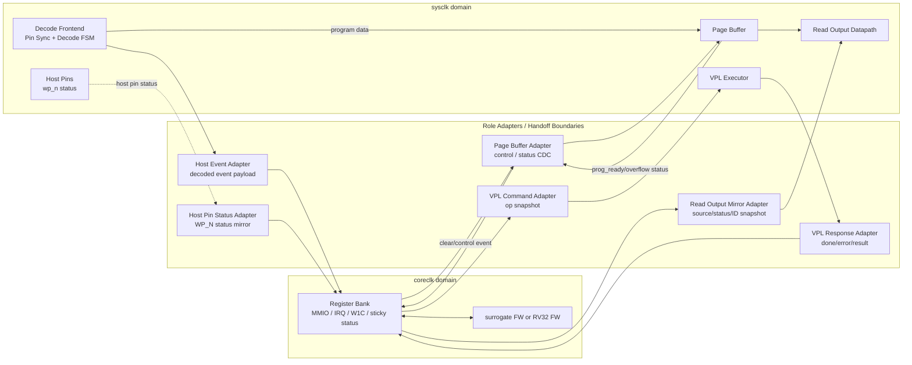

# NAND Adapter Contracts
Version: v0.17
Status: active

## 1. 문서 목적

본 문서는 Decode FSM, Register Bank, Page Buffer, VPL, Read Output block 사이에
사용하는 NAND-specific adapter contract를 정의한다. 기존 Host Event/Data Adapter
범위를 확장해, NAND model의 canonical adapter contract 문서로 사용한다.

Architecture-level 방향은 `Architecture.md`를 따른다. Page Buffer RTL ownership과
현재 구현 범위는 `nand_page_buffer.md`를 따른다. Register map, IRQ, W1C,
FW-visible side effect는 `nand_register_bank.md`를 따른다. VPL operation 의미는
`nand_model_vpl.md`를 따른다. CDC primitive와 formal 검증 기준은
`nand_cdc_ip.md`를 따른다.

참조 문서:

- `Architecture.md`
- `nand_page_buffer.md`
- `nand_register_bank.md`
- `nand_model_vpl.md`
- `nand_cdc_ip.md`

## 2. Adapter 구조

Host Event Adapter, Host Pin Status Adapter, Page Buffer Adapter,
VPL Command/Response Adapter, Read Output Mirror Adapter는 역할 이름이다.
Handoff가 valid/ready/payload, level sync, 또는 동등한 CDC-safe protocol로
표현될 수 있으면 가능한 한 parameterized reusable adapter primitive를 instance해
구현한다.



`nand_logic_top` 같은 상위 integration shell은 Decode Frontend, role adapter,
Register Bank, Page Buffer/VPL/Read Output block을 instance하고 wire로 연결하는
것을 기본으로 한다. Raw CDC primitive가 top-level glue logic으로 흩어지지 않게
adapter role 내부에 둔다.
기준 구조에서 Decode FSM과 Page Buffer는 같은 sysclk domain에 있으므로
2048-byte program data stream은 adapter CDC를 거치지 않고 Page Buffer write path로
직접 전달한다. Page Buffer Adapter는 Register Bank와 Page Buffer 사이의 작은
control/status event handoff를 담당한다.

## 3. 공통 Reusable Adapter 규칙

공통 adapter primitive의 기본 transaction form은 아래와 같다.

```text
source domain:
  src_valid
  src_ready
  src_payload[PAYLOAD_WIDTH-1:0]

destination domain:
  dst_valid
  dst_ready
  dst_payload[PAYLOAD_WIDTH-1:0]
```

공통 규칙:

- source는 `src_valid && src_ready` accept 전까지 payload를 안정적으로 유지한다.
- destination은 `dst_valid && dst_ready`에서 payload를 consume한다.
- 기본 outstanding transaction 수는 1개다.
- multi-bit payload는 bit별 synchronizer로 넘기지 않는다.
- pulse는 clock domain을 직접 넘기지 않고 valid/ack, toggle, request/ack으로 변환한다.
- single-bit level status는 오래 유지되는 상태에 한해 2FF level sync를 사용할 수 있다.
- command/response 양방향 protocol은 command path와 response path를 독립 adapter
  channel로 둔다.
- stream이 연속 throughput을 요구하면 같은 clock direct stream을 우선한다. 서로 다른
  clock 구조에서는 async FIFO 또는 stream 전용 adapter contract를 별도로 정의한다.
- FW-visible IRQ, W1C clear, sticky status ownership은 Register Bank에 둔다.
  Adapter는 FW-visible IRQ pending을 직접 만들거나 clear하지 않는다.

현재 기준으로 참조할 reusable RTL은 NAND repo 내부의 아래 파일이다.

- `../nand_model/cdc_valid_ack.sv`
- `../nand_model/cdc_level_sync.sv`
- `../nand_model/external_event_adapter.sv`

NAND 쪽 현재 adapter reference implementation은
`../nand_model/nand_role_adapters.v`다. `nand_host_event_adapter`는 reusable
payload adapter를 instance해 sysclk Decode domain에서 coreclk Register Bank
domain으로 event payload를 넘긴다. Page Buffer bulk write/count/freeze ownership은
`nand_page_buffer.md`와 `../nand_model/nand_page_buffer.v`의 `nand_page_buffer`가
직접 가진다.

## 4. Host Event Adapter

Host Event Adapter는 Decode FSM이 만든 transaction-complete event를 atomic
snapshot으로 받아 Register Bank transaction port에 commit한다.

Decode side 권장 port:

```text
decode_event_valid
decode_event_ready
decode_event_payload
```

payload에는 최소한 아래 값이 포함된다.

| Field | 의미 |
| --- | --- |
| `decoded_op` | Reset, Read ID, Read Status, Read Page, Program, Erase 등 transaction 종류 |
| `cmd` | 확정 command 또는 confirm command |
| `addr0..addr4` | ONFI address byte 원본 snapshot |
| `addr_count` | valid address byte 수 |
| `prog_data_count` | Program confirm 시점까지 sysclk Page Buffer write path가 accept한 data byte 수 |
| `protocol_error` | decode/protocol error 여부 |
| `protocol_error_code` | error code |

Host Event Adapter 규칙:

- `decode_event_ready == 0`이면 Decode FSM은 새 complete event를 시작하지 않는다.
- `decode_event_valid == 1` 이후 accept 전까지 payload를 유지한다.
- event accept는 `decode_event_valid && decode_event_ready`로 정의한다.
- accepted event/address snapshot은 Register Bank mailbox에 atomic commit한다.
- Register Bank busy/status에서 유도되는 host-facing lockout mirror는 Host Event
  Adapter 내부의 level handoff로 sysclk Decode side에 되돌린다.
- pending event가 clear되기 전 새 event를 받을지 여부는 Register Bank ready/busy
  정책을 따른다.
- protocol 위반은 silent drop하지 않고 Register Bank status/error로 남길 수 있게 한다.

## 5. Host Pin Status Adapter

Host Pin Status Adapter는 host-facing pin 중 Register Bank/FW-visible status로
필요한 값을 coreclk domain으로 mirror한다. 현재 RTL 기준 대상은 `wp_n`이다.

기준 규칙:

- `wp_n` physical pin은 `nand_logic_top`의 host-facing public pin으로 남긴다.
- coreclk Register Bank가 보는 `wp_n` status는 adapter 내부 CDC handoff를 거친다.
- `wp_n` mirror는 command decode event payload와 섞지 않는다.
- single-bit status mirror이므로 오래 유지되는 level sync를 사용할 수 있다.

## 6. Page Buffer Adapter

Page Buffer Adapter는 Register Bank와 Page Buffer 사이의 control/status handoff를
담당한다. 2048-byte program data input stream은 Decode FSM과 Page Buffer가 같은
sysclk domain에 있으므로 이 adapter를 통과하지 않는다. 현재 RTL에서는
`nand_page_buffer`가 program data stream, write count, freeze/prog_ready, overflow,
storage를 직접 소유한다.

Decode FSM에서 Page Buffer로 가는 sysclk-local program stream:

```text
prog_data_valid
prog_data_ready
prog_data_byte[7:0]
```

Page Buffer 내부 write monitor:

```text
write_valid
write_addr
write_data[7:0]
```

이 stream의 기준:

- `prog_data_valid && prog_data_ready`인 byte만 Page Buffer write로 commit한다.
- `prog_data_ready == 0`이면 Decode FSM은 data input을 accept하지 않거나 문서화된
  protocol error/backpressure 정책을 적용한다.
- `write_valid/write_addr/write_data`는 Page Buffer가 실제 accept한 write를 관찰하기
  위한 monitor 성격이며, Page Buffer 외부에 별도 write-ready owner를 두지 않는다.
- `prog_data_count`는 Page Buffer write path가 실제 accept한 byte 수와 일치해야 한다.
- maximum page size 초과는 Page Buffer overflow status로 남긴다.
- 현재 Page Buffer RTL은 freeze 상태 추가 write에 별도 error bit를 만들지 않고
  ready deassert로 backpressure한다. 이를 protocol error로 볼지 여부는 Decode FSM 또는
  상위 integration 정책에서 별도 정의한다.

Page Buffer Adapter가 담당하는 coreclk/sysclk handoff:

- Register Bank에서 오는 clear/control event를 Page Buffer domain으로 전달한다.
- Page Buffer domain의 `prog_ready`, `overflow` status snapshot을
  Register Bank domain으로 전달한다.
- Program confirm event가 accepted된 뒤 Page Buffer를 freeze/prog-ready 상태로
  전환해야 할 경우, 그 sysclk-local 상태 변화와 Register Bank-visible status mirror를
  분리해 관리한다.
- FW debug data access는 현재 Page Buffer Adapter contract 밖이다. 해당 접근은 bulk
  program path가 아니라 별도 control/status 또는 debug stream contract로 정의한다.

Page Buffer Adapter는 NAND-specific clear/status policy와 작은 CDC handoff를
포함한다. 2048-byte bulk data CDC는 현재 contract 밖이며, `cdc_valid_ack` 반복
사용이 아니라 async FIFO 또는 stream 전용 adapter contract로 다룬다.
현재 RTL은 Register Bank 입력 계약에 맞춰 `prog_ready`와 `overflow`를 coreclk로
mirror하고, byte count는 Decode event의 `prog_data_count`와 sysclk Page Buffer
write path output으로 유지한다. Register Bank에 별도 Page Buffer count mirror는
현재 contract에 없다.

## 7. VPL Command/Response Adapter

VPL Command/Response Adapter는 Register Bank와 VPL executor 사이의 command와
response channel을 분리한다.

Command path:

```text
Register Bank coreclk
  -> VPL Command Adapter
  -> VPL sysclk
```

Command payload 예시:

| Field | 의미 |
| --- | --- |
| `op_ctrl` | VPL opcode/options |
| `block/page/column` | operation target snapshot |
| `page_bytes` | page size snapshot |
| `latency` | model busy latency option |
| `bias/debug` | VREAD/VPGM/VPASS/VERS, BL/WL/line control, bias profile |

Response path:

```text
VPL sysclk
  -> VPL Response Adapter
  -> Register Bank coreclk
```

Response payload 예시:

| Field | 의미 |
| --- | --- |
| `done` | VPL operation 완료 |
| `error` | VPL operation error |
| `error_code` | Register Bank가 `REG_OP_ERROR`로 노출할 error code |
| `fail` | NAND status fail bit source |
| `pb_valid` | Read/Page Buffer result가 valid함 |

Command와 response를 하나의 bidirectional CDC channel에 섞지 않는다. 각각 독립
adapter channel을 사용해 ownership과 deadlock 조건을 단순하게 유지한다.

## 8. Read Output Mirror Adapter

Read Output Mirror Adapter는 Register Bank coreclk domain의 output
source/status/Read ID address control을 sysclk domain의 Read Output Datapath로
넘긴다.

Mirror payload 예시:

| Field | 의미 |
| --- | --- |
| `readout_source` | ID, status, page buffer 등 output source 선택 |
| `readout_enable` | host `re_n` read에 output datapath 사용 허용 |
| `status_byte` | Read Status용 NAND status snapshot |
| `read_id_addr` | Read ID `00h`/`20h` table 선택용 accepted address snapshot |
| `ptr_reset` | readout pointer reset request |

Read Output Datapath는 host `re_n` timing에 맞춰 dq를 내보내야 하므로 FW/coreclk
latency를 read path에 직접 넣지 않는다. Register Bank에서 준비한 source/status/ID
address 정보는 adapter가 sysclk-local snapshot으로 mirror한다.

## 9. Busy and Backpressure

Host command gating은 Decode FSM과 Host Event Adapter가 함께 수행한다.

권장 의미:

- `decode_event_ready`: Host Event Adapter/Register Bank가 새 decoded event를 받을 수 있음
- `host_busy_i`: Register Bank/VPL/Control Agent 상태를 반영한 host-facing busy 또는 lockout
- `adapter_busy_o`: Adapter가 accepted event 처리 또는 pending handoff 때문에 새 event를 막는 상태
- `fsm_backpressure`: Decode FSM이 같은 resource에 대한 새 command/address/data phase를 막는 상태

Decode FSM은 `host_busy_i` 또는 `decode_event_ready == 0` 상태에서 일반 command를
ignore/error/lockout 중 문서화된 정책으로 처리한다. Busy 중 허용 command
예외(`70h`, `FFh`)는 `SIMPLE_ONFI_SDR_decode_fsm.md`를 따른다.

## 10. 현재 RTL Mapping

| Adapter 역할 | 현재 RTL 기준 | 비고 |
| --- | --- | --- |
| Host Event Adapter | `../nand_model/nand_role_adapters.v` / `nand_host_event_adapter` | sysclk Decode event payload를 coreclk Register Bank로 CDC handoff하고 Register Bank busy mirror를 sysclk host-facing lockout으로 되돌림 |
| Host Pin Status Adapter | `../nand_model/nand_role_adapters.v` / `nand_host_pin_status_adapter` | host-facing `wp_n` physical pin을 coreclk Register Bank status mirror로 CDC handoff |
| Page Buffer data path | `../nand_model/nand_page_buffer.v` / `nand_page_buffer` | Decode FSM과 Page Buffer를 같은 sysclk domain에 두고 program byte stream을 직접 전달 |
| Page Buffer control/status Adapter | `../nand_model/nand_role_adapters.v` / `nand_page_buffer_adapter` | Register Bank/Page Buffer 사이 clear/prog_ready/overflow CDC handoff |
| VPL Command Adapter | `../nand_model/nand_role_adapters.v` / `nand_vpl_command_response_adapter` | Register Bank command snapshot을 sysclk VPL로 payload handoff |
| VPL Response Adapter | `../nand_model/nand_role_adapters.v` / `nand_vpl_command_response_adapter` | sysclk VPL done/error/result를 coreclk Register Bank로 payload handoff |
| Read Output Mirror Adapter | `../nand_model/nand_role_adapters.v` / `nand_read_output_mirror_adapter` | Register Bank status/source/ID address snapshot을 sysclk Read Output Datapath로 mirror |

## Version History

| Version | Description |
| --- | --- |
| v0.17 | CDC primitive 참조를 NAND-owned vendored IP와 `nand_cdc_ip.md` 기준으로 갱신. |
| v0.16 | 미래형 표현을 현재 adapter contract와 out-of-scope 표현으로 정리하고 문서 status를 active로 갱신. |
| v0.15 | 삭제된 Page Buffer CDC/timing 참고 노트 참조를 current adapter contract에서 제거. |
| v0.14 | Host Event Adapter의 Register Bank busy mirror와 Host Pin Status Adapter의 `wp_n` mirror 역할을 현재 RTL mapping에 반영. |
| v0.13 | Read Output Mirror Adapter payload에 Read ID address snapshot을 추가하고 Read Output Datapath RTL contract와 연결. |
| v0.12 | Page Buffer RTL 상세 계약 문서 `nand_page_buffer.md`를 참조하고 freeze 상태 write/error 표현을 현재 RTL의 ready backpressure 정책에 맞춰 정리. |
| v0.11 | Page Buffer bulk write/count/freeze ownership을 `nand_page_buffer`로 이동하고 adapter contract에서 write helper 표현을 제거. |
| v0.10 | Host Event Adapter와 sysclk Page Buffer write path를 `nand_role_adapters.v` 기준으로 통합한 현재 RTL mapping을 반영. |
| v0.9 | `nand_role_adapters.v` 구현에 맞춰 Page Buffer control/status, VPL Command/Response, Read Output Mirror Adapter RTL mapping을 갱신. |
| v0.8 | `host/sysclk` 표현을 `sysclk`로 통일하고 현재 RTL mapping을 Host Event CDC와 sysclk-local Page Buffer write helper로 갱신. |
| v0.7 | 당시 `onfi_sdr_decode_adapter.v`의 Page Buffer stream logic은 초기 구현이며 authoritative Page Buffer Adapter contract는 control/status handoff임을 명시. |
| v0.6 | Page Buffer program data stream은 sysclk direct path로 정의하고 Page Buffer Adapter를 Register Bank/Page Buffer control-status CDC handoff로 한정. |
| v0.5 | 문서 목적과 adapter 구조 설명을 한국어 중심으로 정리하고 Architecture diagram 용어와 맞춤. |
| v0.4 | `nand_adapter_contracts.md`를 NAND Adapter Contracts로 승격하고 reusable adapter primitive, VPL Command/Response Adapter, Read Output Mirror Adapter contract와 mermaid diagram을 추가. |
| v0.3 | Register Bank 상세 MMIO/IRQ/W1C contract 분리에 맞춰 `nand_register_bank.md`와 PicoRV32 `register_bank.md` 참조를 추가. |
| v0.2 | Decode/Register Bank/Page Buffer clock domain 분리를 전제로 adapter CDC 기준과 PicoRV32 CDC IP 참조 방식을 명시. |
| v0.1 | Host Event Adapter와 Page Buffer Adapter의 NAND-specific handoff, ownership, busy/backpressure contract 최초 정리. |
