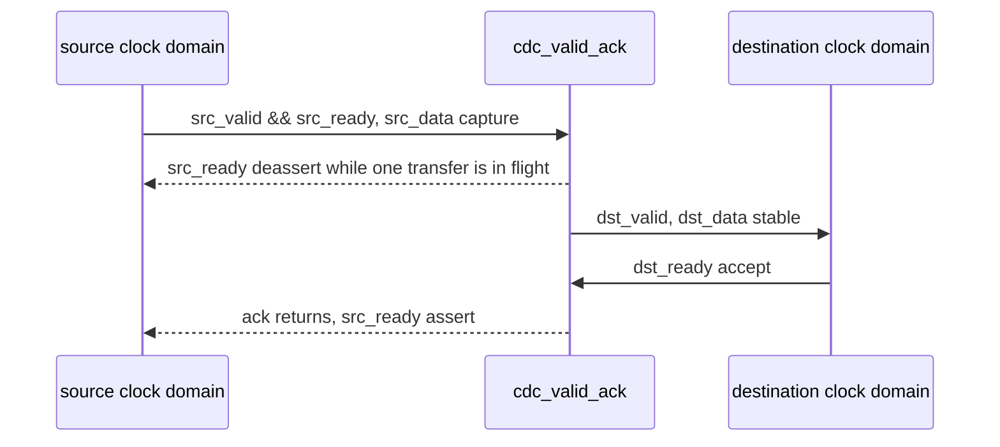
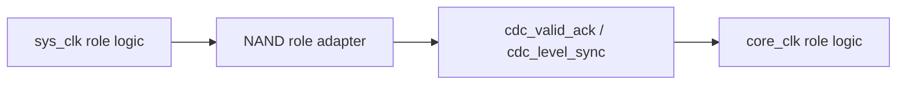
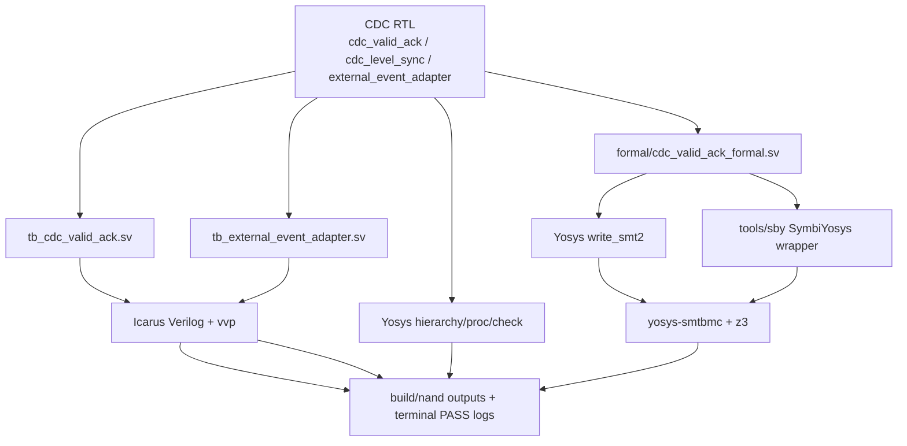

# NAND CDC IP
Version: v0.4
Status: active

## 1. 문서 목적

이 문서는 NAND repo 안에 포함된 reusable CDC IP와 검증 방법을 정의한다. CDC IP는
`nand_model/` 아래에 있으며, NAND role adapter가 clock domain boundary를 명확히
유지하기 위해 사용한다.

## 2. 포함 파일

| 파일 | 역할 |
| --- | --- |
| `../nand_model/cdc_valid_ack.sv` | multi-bit payload를 한 건씩 넘기는 valid/ack CDC primitive |
| `../nand_model/cdc_level_sync.sv` | single-bit level 2FF synchronizer |
| `../nand_model/external_event_adapter.sv` | `cdc_valid_ack`와 optional level IRQ sync를 묶은 generic wrapper |
| `../tb/tb_cdc_valid_ack.sv` | payload CDC directed simulation |
| `../tb/tb_external_event_adapter.sv` | wrapper event/IRQ directed simulation |
| `../formal/cdc_valid_ack_formal.sv` | `cdc_valid_ack` bounded formal harness |
| `../formal/cdc_valid_ack.sby` | SymbiYosys wrapper |
| `../tools/sby/` | SymbiYosys tool source submodule |

## 3. CDC Primitive 선택 기준

| 상황 | 사용할 IP | 사용하지 말 것 |
| --- | --- | --- |
| single-bit level flag/status mirror | `cdc_level_sync` | multi-bit payload bit별 sync |
| command/event/result payload 한 건 handoff | `cdc_valid_ack` | free-running bus sampling |
| 외부 event valid/data와 optional IRQ level을 같이 넘김 | `external_event_adapter` 또는 role-specific wrapper | Register Bank 내부 async 직접 입력 |
| 2048-byte 같은 bulk stream CDC | 별도 async FIFO/stream adapter contract | `cdc_valid_ack` 반복으로 byte stream 대체 |

## 4. `cdc_valid_ack` 계약



규칙:

- Source는 `src_valid && src_ready`일 때만 새 payload를 보낸다.
- Payload는 destination이 `dst_valid && dst_ready`로 accept할 때까지 stable해야 한다.
- 한 번에 in-flight payload는 1개다.
- 이 primitive는 low-throughput event/command/result handoff용이다.

## 5. `cdc_level_sync` 계약

`cdc_level_sync`는 single-bit level을 destination clock에서 2FF로 동기화한다.

사용 예:

- Register Bank busy mirror
- FW-ready mirror
- WP_N status mirror
- 오래 유지되는 enable/status flag

사용 금지:

- multi-bit payload
- pulse가 destination clock에서 놓치면 안 되는 event
- byte stream data path

## 6. NAND Role Adapter와의 관계

NAND architecture 문서의 Host Event Adapter, Page Buffer Adapter, VPL
Command/Response Adapter, Read Output Mirror Adapter는 역할 이름이다. 구현은 가능한
한 이 문서의 reusable CDC primitive를 instance한다.



Role adapter가 해야 할 일:

- NAND-specific payload packing/unpacking
- ready/busy/backpressure 의미 부여
- CDC primitive instance
- Register Bank 또는 sysclk block이 직접 async signal을 보지 않게 boundary 유지

Role adapter가 하지 말아야 할 일:

- FW-visible IRQ pending/W1C ownership 생성
- Register Bank bitfield side effect 직접 구현
- bulk page data를 `cdc_valid_ack`로 byte-by-byte 대체

## 7. 왜 별도 CDC 검증이 필요한가

CDC IP는 일반 RTL보다 버그가 숨어 있기 쉽다. simulation에서 한 clock ratio와 한
reset timing으로 통과해도, 실제로는 source/destination clock phase, backpressure,
reset skew, payload hold rule 위반에서 문제가 생길 수 있다.

이 repo에서 CDC IP는 Host Event Adapter, Page Buffer control/status Adapter, VPL
Command/Response Adapter, Read Output Mirror Adapter 같은 여러 role adapter의 공통
기반이다. 따라서 CDC primitive는 단순히 top full-sim에서 한 번 지나갔다고 충분하지
않고, 아래 관점으로 따로 확인한다.

| 검증 방법 | 사용하는 이유 | 확인하지 못하는 것 |
| --- | --- | --- |
| Directed simulation | 실제 source/destination clock을 다르게 두고 payload 순서, backpressure, PASS/FAIL 로그를 확인 | 모든 clock ratio, 모든 reset skew, metastability |
| Yosys lint/check | CDC RTL이 parameter elaboration, hierarchy, process lowering, driver/latch 관점에서 obvious structural issue가 없는지 확인 | CDC crossing intent 자동 signoff, reconvergence/glitch 분석 |
| Bounded formal | 임의 payload와 임의 destination backpressure에서 작성한 protocol assertion이 bound 안에서 깨지지 않는지 확인 | analog metastability, 무한 시간 증명, 실제 async phase 전체 증명 |

현재 결과는 **CDC smoke + directed simulation + bounded formal sanity 검증 완료**로
해석한다. **CDC signoff 완료**로 표현하지 않는다. 물리 signoff, MTBF 계산, CDC
reconvergence 분석은 별도 CDC signoff tool/flow가 필요하다.

## 8. 검증 Flow



사용 tool:

| Tool | repo에서의 용도 |
| --- | --- |
| `iverilog` | CDC directed TB compile |
| `vvp` | compiled simulation 실행 |
| `yosys` | lint/check와 formal SMT2 model 생성 |
| `yosys-smtbmc` | bounded model checking 실행 |
| `z3` | SMT solver, `SMTBMC_SOLVER ?= z3` |
| `sby` | SymbiYosys wrapper 실행용. Makefile 기본값은 `tools/sby` submodule source이며 installed `sby`는 명시 override 시 사용한다 |

기본 실행 command:

Simulation targets:

```text
make sim TB=tb_cdc_valid_ack
make sim TB=tb_external_event_adapter
```

Lint/formal targets:

```text
make cdc-lint
make cdc-formal
make cdc-formal-sby
```

`make cdc-formal`은 내부적으로 아래 두 단계를 수행한다.

```text
yosys -p "read_verilog -formal -sv formal/cdc_valid_ack_formal.sv nand_model/cdc_valid_ack.sv; prep -top cdc_valid_ack_formal; write_smt2 -wires build/nand/cdc_valid_ack_formal.smt2"
PATH=$(HOME)/.local/bin:$PATH yosys-smtbmc -s z3 -t 32 build/nand/cdc_valid_ack_formal.smt2
```

`formal/cdc_valid_ack.sby`도 함께 보관한다. SymbiYosys가 설치된 환경에서는 아래처럼
같은 harness를 wrapper flow로 실행할 수 있다.

```text
sby -f formal/cdc_valid_ack.sby
```

이 repo는 `tools/sby`를 SymbiYosys source submodule로 둔다. `make
cdc-formal-sby`의 기본값은 repo-local `tools/sby/sbysrc/sby.py`다. 이렇게 해야
system `sby` version 차이가 있어도 repo가 pin한 wrapper flow를 먼저 재현할 수 있다.
다른 `sby` command를 쓰고 싶으면 `make SBY=/path/to/sby cdc-formal-sby`처럼
명시적으로 override한다. submodule이 비어 있으면 아래 command로 초기화한다.

```text
git submodule update --init tools/sby
```

의존성 설치 helper는 apt 기반 tool을 설치한 뒤 같은 submodule source에서 `sby`를
설치한다.

```text
bash scripts/install_deps.sh
```

현재 canonical CI/Makefile command는 `make cdc-formal`이고, SymbiYosys wrapper
경로 확인은 `make cdc-formal-sby`를 사용한다.

## 9. Directed Simulation

### `tb/tb_cdc_valid_ack.sv`

검증 범위:

- source clock과 destination clock의 다른 period
- reset release offset
- 여러 transaction 연속 전송
- destination backpressure
- source accept 후 `src_ready`가 busy 동안 내려가는지
- destination backpressure 중 `dst_valid`와 `dst_data`가 유지되는지
- accept된 payload가 순서대로 destination에서 관측되는지
- 한 번에 하나의 payload만 in-flight인지

PASS 로그:

```text
PASS: cdc_valid_ack directed CDC test
```

### `tb/tb_external_event_adapter.sv`

검증 범위:

- external payload가 adapter를 지나 destination domain에 전달되는지
- destination side backpressure 동안 event data가 stable한지
- source side `ext_ready`가 ack 후 복귀하는지
- optional `ext_irq` level이 destination clock domain으로 sync되는지

PASS 로그:

```text
PASS: external_event_adapter directed CDC test
```

## 10. Yosys Lint / Structural Check

`make cdc-lint`는 Yosys로 CDC RTL을 elaborate하고 기본 structural check를 수행한다.

현재 확인 범위:

- `external_event_adapter` top hierarchy
- `cdc_valid_ack`, `cdc_level_sync` parameter elaboration
- process lowering 후 latch/driver 같은 obvious issue check

PASS 기준:

```text
found and reported 0 problems.
```

이 결과는 CDC signoff가 아니다. Yosys `check`는 crossing intent를 자동 분류하거나
metastability/reconvergence를 분석하지 않는다.

## 11. Bounded Formal

`formal/cdc_valid_ack_formal.sv`는 `cdc_valid_ack`를 대상으로 protocol-level
assertion을 확인한다.

현재 proof 설정:

| 항목 | 값 |
| --- | --- |
| target RTL | `nand_model/cdc_valid_ack.sv` |
| harness | `formal/cdc_valid_ack_formal.sv` |
| model generation | Yosys `write_smt2` |
| BMC engine | `yosys-smtbmc` |
| solver | `z3` |
| bound | 32 steps |
| abstraction | source/destination clock을 같은 formal clock으로 묶은 protocol sanity model |

Formal harness 입력은 `(* anyseq *)`로 source start, source data, destination ready를
임의화한다. 즉 directed TB가 특정 data/backpressure sequence를 보는 것과 달리,
formal은 bound 안에서 가능한 여러 payload/backpressure 조합을 solver가 탐색한다.

검증 property:

- source accept 시 outstanding transaction이 이미 존재하지 않아야 한다.
- destination accept 시 pending transaction이 존재해야 한다.
- destination에서 accept한 data는 pending source data와 같아야 한다.
- source accept 다음 cycle에는 `src_ready`가 내려가 busy/backpressure가 걸려야 한다.
- `dst_valid && !dst_ready` 동안 `dst_valid`와 `dst_data`가 유지되어야 한다.

PASS 기준:

```text
Status: PASSED
```

이 문장은 32-step bound 안에서 harness에 작성된 assertion이 깨지지 않았다는 뜻이다.
이는 protocol sanity proof이지 물리 CDC signoff가 아니다.

## 12. 산출물과 로그 판독

| 산출물 | 생성 명령 | 의미 |
| --- | --- | --- |
| `build/nand/tb_cdc_valid_ack.vvp` | `make sim TB=tb_cdc_valid_ack` | `cdc_valid_ack` simulation executable |
| `build/nand/tb_external_event_adapter.vvp` | `make sim TB=tb_external_event_adapter` | `external_event_adapter` simulation executable |
| `build/nand/cdc_valid_ack_formal.smt2` | `make cdc-formal` | Yosys가 생성한 formal SMT2 model |
| `build/nand/sby_cdc_valid_ack/` | `make cdc-formal-sby` | SymbiYosys wrapper work directory |

Makefile은 기본적으로 terminal에 로그를 출력한다. 로그 파일을 남기고 싶으면 shell에서
아래처럼 redirect한다.

```text
make sim TB=tb_cdc_valid_ack 2>&1 | tee build/nand/tb_cdc_valid_ack.log
make sim TB=tb_external_event_adapter 2>&1 | tee build/nand/tb_external_event_adapter.log
make cdc-lint 2>&1 | tee build/nand/cdc-lint.log
make cdc-formal 2>&1 | tee build/nand/cdc-formal.log
make cdc-formal-sby 2>&1 | tee build/nand/cdc-formal-sby.log
```

결과 판독:

| 항목 | PASS로 볼 수 있는 문구 |
| --- | --- |
| payload directed simulation | `PASS: cdc_valid_ack directed CDC test` |
| adapter directed simulation | `PASS: external_event_adapter directed CDC test` |
| Yosys structural check | `found and reported 0 problems.` |
| bounded formal | `Status: PASSED` |

## 13. 해석과 한계

현재 결과로 말할 수 있는 것:

- 현재 RTL과 testbench 조건에서는 payload loss/duplicate/order mismatch가 보이지 않는다.
- adapter의 payload CDC와 optional IRQ level sync wrapper가 directed scenario에서 동작한다.
- Yosys elaboration/check 기준 obvious structural issue가 없다.
- 작성한 bounded formal property는 32-step 안에서 깨지지 않는다.

현재 결과로 말하면 안 되는 것:

- analog metastability 자체를 증명하지 않는다.
- 모든 clock ratio에서 안전하다고 단정하지 않는다.
- 모든 reset skew에서 안전하다고 단정하지 않는다.
- 물리 CDC signoff가 끝났다고 표현하지 않는다.

`cdc_level_sync`는 simple 2FF level synchronizer라 directed/lint 관점에서 확인한다.
payload formal의 대상은 `cdc_valid_ack`다. multi-bit payload는 bit별 synchronizer로
넘기지 않고 `cdc_valid_ack` 또는 별도 async FIFO/stream adapter로 넘겨야 한다.

## Version History

| Version | Description |
| --- | --- |
| v0.4 | Makefile alias target 제거에 맞춰 CDC 실행 명령을 `sim TB=...`, `cdc-lint`, `cdc-formal`, `cdc-formal-sby`로 갱신. |
| v0.3 | `tools/sby` SymbiYosys tool submodule과 `make test-cdc-formal-sby` wrapper flow를 검증 문서에 반영. |
| v0.2 | CDC 검증 목적, tool 선택 이유, command, flow, directed/lint/formal coverage, 산출물, PASS 로그, 한계를 상세화. |
| v0.1 | NAND repo 내부 CDC primitive, role adapter 사용 기준, directed/formal verification target 계약 최초 작성. |
