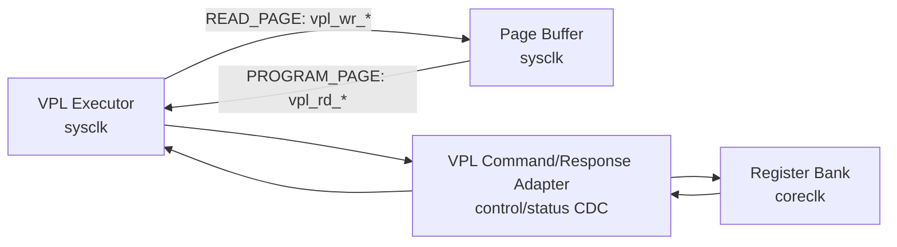

# NAND Model Virtual Physical Layer
Version: v0.11

본 문서는 SIMPLE NAND 모델의 Virtual Physical Layer(VPL) 설계 방향을 정의한다.
VPL은 실제 cell transistor를 모사하지 않고, Register Bank/VPL Command/Response
Adapter가 전달한 operation snapshot을 NAND array model(`mem`)과 page buffer 갱신으로
실행하는 계층이다.

Register offset, bit field, error code, W1C/IRQ 정책은 `nand_register_bank.md`를
따른다. FW flow는 `nand_control_fw.md`, cell-level line/bias 의미는
`nand_cell_operation.md`를 기준으로 한다.

## 1. 핵심 원칙

VPL은 전압/라인 조합으로 operation을 추론하지 않는다.

```text
FW writes Register Bank MMIO fields
FW writes REG_OP_TRIGGER.START = 1
Register Bank snapshots command through VPL Command/Response Adapter
VPL executes case(snapshot.OP_CODE)
VPL returns done/error/status result to Register Bank
Register Bank updates FW-visible status/IRQ/W1C state
```

전압, WL, BL, SSL/GSL register는 교육용, 디버그용, 선택적 bias checker용이다.
Functional path의 operation 판정 기준은 `OP_CODE` 하나다.

## 2. VPL 책임

- VPL Command/Response Adapter가 전달한 target/opcode/options snapshot을 latch한다.
- `READ_PAGE`는 `mem -> page_buffer` copy로 수행한다.
- `PROGRAM_PAGE`는 `mem <= mem & page_buffer`로 수행한다.
- `ERASE_BLOCK`은 selected block을 `8'hFF`로 채운다.
- Busy/Done/Error/PB valid에 해당하는 result를 Register Bank로 반환한다.
- 현재 RTL scope에서는 opcode/range/page-buffer-ready/overflow를 검사한다.
- write-protect, strict erased-page, bias-profile mismatch는 command snapshot의
  option bit로 accept하지만 현재 executor에서는 enforce하지 않는다.

## 3. VPL이 하지 않는 일

- Host ONFI command/address cycle 직접 해석
- `REG_VPGM_LEVEL`, `REG_VPASS_LEVEL`, `REG_BL_CTRL`, `REG_LINE_CTRL` 조합으로 read/program/erase 추론
- FW-visible MMIO register, IRQ pending, W1C clear 직접 소유
- analog BL sensing, threshold voltage distribution, disturb, wear, ECC 모델링
- Control Agent/FW IRQ sequencing 결정

## 4. Register Bank / Adapter 계약 요약

VPL functional path는 live MMIO register를 직접 읽지 않는다. Register Bank가
`REG_OP_TRIGGER.START` write를 accept하면 VPL Command/Response Adapter를 통해 아래
command snapshot을 전달한다.

Command snapshot:

- `OP_CODE`
- target block/page/column
- strict program, write-protect check, bias check option
- optional bias/debug profile
- operation latency override 또는 scale code

VPL은 operation 진행과 완료를 result signal/handshake로 반환한다.

Response/result:

- busy/done/error
- error code
- fail and page-buffer-valid result source
- read page의 page-buffer valid
- program path의 page-buffer readiness/error observation

FW-visible `REG_OP_STATUS`, `REG_OP_ERROR`, `REG_NAND_STATUS`, `REG_IRQ_STATUS`를
latch하고 clear 정책을 적용하는 owner는 Register Bank다. 세부 bitfield와 error code
encoding은 `nand_register_bank.md`를 따른다.

## 5. Page Buffer Direct Port 계약

VPL은 Page Buffer bulk data를 Register Bank 또는 CDC adapter를 통해 주고받지 않는다.
현재 architecture 기준에서 VPL과 Page Buffer는 같은 sysclk domain에 있으므로, VPL은
Page Buffer가 제공하는 sysclk-local direct port를 사용한다. Page Buffer port의 owner
관점 상세 계약은 `nand_page_buffer.md`를 따른다.



`READ_PAGE`에서 VPL이 사용하는 Page Buffer write port:

| Signal | VPL 방향 | 의미 |
| --- | --- | --- |
| `vpl_wr_valid_o` | output | VPL이 Page Buffer에 write byte를 제공 |
| `vpl_wr_ready_i` | input | Page Buffer가 write byte를 accept 가능 |
| `vpl_wr_addr_o[12:0]` | output | Page Buffer write byte address |
| `vpl_wr_data_o[7:0]` | output | Page Buffer write data byte |

`PROGRAM_PAGE`에서 VPL이 사용하는 Page Buffer read port:

| Signal | VPL 방향 | 의미 |
| --- | --- | --- |
| `vpl_rd_req_valid_o` | output | VPL이 Page Buffer read address를 요청 |
| `vpl_rd_req_ready_i` | input | Page Buffer가 read request accept 가능 |
| `vpl_rd_addr_o[12:0]` | output | Page Buffer read byte address |
| `vpl_rd_data_valid_i` | input | Page Buffer read data valid |
| `vpl_rd_data_ready_o` | output | VPL이 read data consume 가능 |
| `vpl_rd_data_i[7:0]` | input | Page Buffer read data byte |

Port 방향은 VPL module 기준이다. Page Buffer module 기준 방향은
`nand_page_buffer.md`에 반대로 정의한다.

Direct port 사용 규칙:

- `READ_PAGE`는 NAND array byte를 `vpl_wr_*`로 Page Buffer에 채운 뒤 response의
  `pb_valid`를 set한다.
- `PROGRAM_PAGE`는 `pb_prog_ready_i=1`인 상태에서 `vpl_rd_*`로 Page Buffer data를 읽고
  NAND array에 bitwise AND program을 수행한다.
- VPL direct port는 sysclk-local bulk datapath이며, VPL Command/Response Adapter는
  operation snapshot과 done/error/status response만 담당한다.
- VPL은 Page Buffer의 clear/prog_ready/overflow register mirror를 직접 갱신하지
  않는다. 해당 FW-visible 상태는 Page Buffer RTL, Page Buffer Adapter, Register Bank
  계약을 따른다.

## 6. Trigger 규칙

FW가 `REG_OP_TRIGGER.START`에 `1`을 write하면 Register Bank는 command snapshot을
만들어 VPL Command/Response Adapter에 전달한다. VPL은 adapter payload를 latch하고,
operation 진행 중 FW가 live register를 바꿔도 현재 operation에는 영향을 받지 않는다.

Busy 중 `START`가 다시 들어오면 Register Bank 또는 VPL response path가 새 operation을
시작하지 않고 busy error result를 남긴다.

## 7. Optional Bias/Line 의미

아래 register group은 VPL이 operation을 판정하기 위해 해석하지 않는다.
`BIAS_CHECK_EN=1`이면 `REG_BIAS_PROFILE`을 opcode와 비교하는 checker를 둘 수 있지만,
현재 `nand_vpl_executor.v`는 이 optional checker를 아직 enforce하지 않는다.

| Register group | VPL 관점 |
| --- | --- |
| `REG_VREAD_LEVEL`, `REG_VPGM_LEVEL`, `REG_VPASS_LEVEL`, `REG_VERS_LEVEL` | FW가 설정한 bias 의도/debug metadata |
| `REG_BL_CTRL`, `REG_WL_CTRL`, `REG_LINE_CTRL` | cell-level line control 의도/debug metadata |
| `REG_BIAS_PROFILE` | optional bias checker용 profile |

Bias profile encoding과 optional debug register bitfield는 `nand_register_bank.md`를
따른다. Optional checker가 추가되면 불일치 시 VPL은 bias mismatch error result를
반환하고 memory/page buffer를 변경하지 않는다.

## 8. Functional Semantics

### 8.1 `READ_PAGE`

Pre-check:

- block range valid
- page range valid
- column/page byte range valid

현재 executor는 bias profile을 snapshot으로 받지만 read profile mismatch check는
수행하지 않는다.

동작:

```text
page_buffer     <= mem[block][page]
pb_rd_ptr       <= snapshot.COL_SEL
result.pb_valid <= 1
result.done     <= 1
```

Read는 `mem`을 변경하지 않는다.
현재 `nand_vpl_executor.v`는 `vpl_wr_*` port를 사용해 target page 전체를 Page Buffer
동일 offset에 채운다. `snapshot.COL_SEL`은 range check와 operation snapshot
metadata로 유지하며, Page Buffer storage는 full-page mirror로 유지한다.

### 8.2 `PROGRAM_PAGE`

Pre-check:

- block range valid
- page range valid
- column/page byte range valid
- page buffer program data ready

현재 executor는 `WP_CHECK_EN`, `BIAS_CHECK_EN`, `STRICT_PROGRAM` option을 snapshot으로
받지만 write-protect, bias profile mismatch, erased-page check는 수행하지 않는다.

동작:

```text
mem[block][page] <= mem[block][page] & page_buffer
result.done      <= 1
```

Program은 `1 -> 0`만 허용하는 SLC 특성을 bitwise AND로 표현한다.
현재 `nand_vpl_executor.v`는 `vpl_rd_*` port를 사용해 Page Buffer data를 순차적으로
읽고 target page에 program한다.

### 8.3 `ERASE_BLOCK`

Pre-check:

- block range valid

현재 executor는 `WP_CHECK_EN`, `BIAS_CHECK_EN` option을 snapshot으로 받지만
write-protect와 bias profile mismatch check는 수행하지 않는다.

동작:

```text
for each page in block:
    mem[block][page] <= 8'hFF
result.done <= 1
```

Erase는 block 단위이며 `REG_PAGE_SEL`은 무시한다.

## 9. Status와 IRQ

VPL은 operation 진행과 완료를 result signal/handshake로 반환한다.

Operation start는 VPL command accept와 Register Bank `REG_OP_STATUS.BUSY` 상태로
표현한다. VPL이 host-facing `RB_N` pin 또는 `REG_NAND_STATUS.READY`를 직접 drive하지
않는다.

Operation 진행 상태:

- `busy = 1`
- `done = 0`
- `error = 0`

Operation 완료 result:

- `busy = 0`
- `done = 1`
- error 없으면 `error_code = ERR_NONE`
- `pb_valid = 1` if READ_PAGE filled Page Buffer

Error 완료 result:

- `error = 1`
- `error_code`에 error code 기록
- `fail = 1`

Register Bank는 VPL result를 받아 FW-visible status와 IRQ pending을 갱신한다.
`REG_NAND_STATUS.READY`와 top-level `rb_n`은 Register Bank/top integration이 현재
operation/status 상태에서 파생한다. VPL은 done/error/fail/pb_valid 같은 result source만
제공한다.
`REG_OP_CTRL.IRQ_DONE_EN` 또는 `IRQ_ERROR_EN`이 set된 operation의 완료/error response를
받으면 Register Bank가 해당 IRQ pending bit를 set한다.

## 10. 현재 RTL Scope

현재 `nand_model/nand_vpl_executor.v`는 VPL Command/Response Adapter 뒤에 붙는
clocked executor다. 현재 구현은 control/status loop와 기본 array/page-buffer data
operation을 닫는다.

현재 포함된 기능:

- sysclk domain `cmd_valid/cmd_ready` command snapshot accept
- opcode/range/Page Buffer status pre-check
- latency counter
- internal NAND array storage와 model 초기 erased value `8'hFF`
- READ_PAGE의 array-to-page-buffer full-page copy
- PROGRAM_PAGE의 `array <= array & page_buffer` commit
- ERASE_BLOCK의 block fill
- Page Buffer VPL direct port 구동
- `rsp_valid/rsp_ready` response handoff
- read/program/erase success response
- invalid opcode, block/page/column range, Page Buffer not-ready/overflow error response

현재 SIMPLE scope에서 제외한 기능:

- strict program erased-page check
- write-protect check
- bias profile mismatch check

Page Buffer overflow는 현재 별도 public error code가 없으므로 `ERR_PB_NOT_READY`로
반환한다. Error code contract는 `nand_register_bank.md`가 authoritative source다.

## 11. 합성 RTL 유지 기준

- `#delay`는 `REG_OP_LATENCY` 또는 `nand_model/nand_parameters.vh`의 timing parameter 기반 counter로 대체한다.
- trigger 순간 shadow register를 반드시 둔다.
- `mem`/`page_buffer` storage 구현은 `nand_page_buffer.md`의 VPL direct port 계약과
  latency/handshake 규칙을 유지한다.
- page copy/program loop는 multi-cycle state로 유지한다.
- bias register는 waveform/debug visibility를 위해 유지하되 functional correctness를 복잡하게 만들지 않는다.

## Version History

| Version | Description |
| --- | --- |
| v0.11 | Functional semantics의 pre-check 설명을 현재 `nand_vpl_executor.v`가 enforce하는 range/Page Buffer scope와 optional strict/wp/bias checker 예약 의미로 분리. |
| v0.10 | legacy 전환 표현을 제거하고 VPL 문서를 현재 `nand_vpl_executor.v` 구현 scope와 유지 기준 중심으로 정리. |
| v0.9 | VPL result source와 Register Bank/top-owned READY/RB_N status 표현을 분리. |
| v0.8 | `nand_vpl_executor.v` 구현에 맞춰 internal array, READ full-page fill, PROGRAM bitwise-AND commit, ERASE block fill을 현재 RTL scope로 갱신. |
| v0.7 | VPL 관점의 Page Buffer sysclk-local direct write/read port contract와 functional semantics 연결을 추가. |
| v0.6 | `nand_vpl_executor.v`의 최소 clocked executor RTL scope와 deferred array/Page Buffer commit 범위를 명시. |
| v0.5 | 상세 register map/bitfield/error code를 `nand_register_bank.md`로 이동하고 VPL snapshot executor/result source 문서로 정리. |
| v0.4 | Register Bank/VPL Command/Response Adapter ownership을 반영해 VPL을 snapshot executor와 result source로 정리. |
| v0.3 | 공유 파라미터 헤더 `nand_model/nand_parameters.vh` 기준으로 row range/timing parameter 설명을 갱신. |
| v0.2 | FW/FSM 주소 변환 정책과 맞춰 column/row/erase page-bit range error code를 추가. |
| v0.1 | VPL을 `OP_CODE + START` 기반 executor로 재정의하고 optional bias/check 계약을 정리. |
