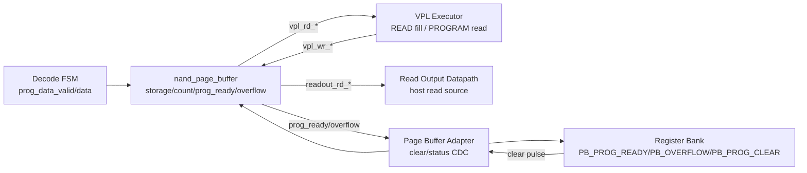

# NAND Page Buffer
Version: v0.6
Status: active

## 1. 문서 목적

본 문서는 `nand_model/nand_page_buffer.v`의 Page Buffer RTL 계약을 정의한다.
상위 clock/domain 배치는 `Architecture.md`, Decode FSM program data stream과
Register Bank/Page Buffer control-status handoff는 `nand_adapter_contracts.md`를
따른다. FW-visible register와 status bit는 `nand_register_bank.md`를 따른다.

이 문서는 현재 구현된 Page Buffer RTL 범위와 VPL/Read Output direct port 계약을
설명한다. SRAM-style memory port 구조, FW debug bulk access는 아직 별도 RTL 계약으로
확정되지 않았다.

## 2. 현재 RTL 범위

`nand_page_buffer`는 sysclk domain의 program-data write path와 Page Buffer 내부 상태를
소유한다.

현재 RTL이 소유하는 것:

- `prog_data_valid_i/prog_data_ready_o/prog_data_i` direct stream accept
- Page Buffer storage array
- module-internal accepted byte count
- `freeze_i` 이후 `prog_ready_o` 상태
- capacity overflow 상태
- clear/reset에 의한 count/status 초기화
- VPL `READ_PAGE` fill용 sysclk-local write port
- VPL `PROGRAM_PAGE` source용 sysclk-local read port
- Read Output Datapath용 sysclk-local read port

현재 RTL이 아직 소유하지 않는 것:

- FW debug bulk access
- ECC/spare/OOB 영역

## 3. Interface Contract

### 3.1 Current Program Stream / Status Port

| Signal | Direction | Domain | 의미 |
| --- | --- | --- | --- |
| `sys_clk`, `sys_rst_n` | input | sysclk | Page Buffer clock/reset |
| `prog_data_valid_i` | input | sysclk | Decode FSM이 program data byte를 제공 |
| `prog_data_ready_o` | output | sysclk | Page Buffer가 현재 byte를 accept 가능 |
| `prog_data_i[7:0]` | input | sysclk | program data byte |
| `clear_i` | input | sysclk | count/prog_ready/overflow clear |
| `freeze_i` | input | sysclk | program data 수신 완료 상태로 고정 |
| `prog_ready_o` | output | sysclk | program source data ready status |
| `overflow_o` | output | sysclk | capacity overflow sticky status |
| `busy_o` | output | sysclk | program stream/status activity indication |

### 3.2 VPL Direct Port Contract

VPL direct port는 Page Buffer와 VPL이 같은 sysclk domain에 있을 때 사용하는 local
datapath다. 이 port는 Register Bank/Page Buffer Adapter를 통과하지 않는다.

`READ_PAGE`에서 VPL은 NAND array data를 Page Buffer에 채운다.

| Signal | Direction | Domain | 의미 |
| --- | --- | --- | --- |
| `vpl_wr_valid_i` | input | sysclk | VPL이 Page Buffer write byte를 제공 |
| `vpl_wr_ready_o` | output | sysclk | Page Buffer가 VPL write byte를 accept 가능 |
| `vpl_wr_addr_i[12:0]` | input | sysclk | VPL write byte address |
| `vpl_wr_data_i[7:0]` | input | sysclk | VPL write data byte |

`PROGRAM_PAGE`에서 VPL은 Page Buffer data를 읽어 NAND array에 program한다.

| Signal | Direction | Domain | 의미 |
| --- | --- | --- | --- |
| `vpl_rd_req_valid_i` | input | sysclk | VPL이 Page Buffer read address를 요청 |
| `vpl_rd_req_ready_o` | output | sysclk | Page Buffer가 read request accept 가능 |
| `vpl_rd_addr_i[12:0]` | input | sysclk | VPL read byte address |
| `vpl_rd_data_valid_o` | output | sysclk | Page Buffer read data valid |
| `vpl_rd_data_ready_i` | input | sysclk | VPL이 read data consume 가능 |
| `vpl_rd_data_o[7:0]` | output | sysclk | Page Buffer read data byte |

기본 계약은 1-byte transaction이다. 이후 array/page copy throughput이 문제가 되면
burst 또는 wider data port를 별도 revision으로 확장한다. 단, Decode FSM program data
stream과 Register Bank control/status adapter 계약은 그대로 유지한다.

### 3.3 Read Output Direct Read Port Contract

Read Output direct port는 Page Buffer와 Read Output Datapath가 같은 sysclk domain에
있을 때 사용하는 local read datapath다. 이 port는 Register Bank/Page Buffer Adapter를
통과하지 않는다.

| Signal | Direction | Domain | 의미 |
| --- | --- | --- | --- |
| `readout_rd_req_valid_i` | input | sysclk | Read Output Datapath가 Page Buffer read address를 요청 |
| `readout_rd_req_ready_o` | output | sysclk | Page Buffer가 read request accept 가능 |
| `readout_rd_addr_i[12:0]` | input | sysclk | Read Output read byte address |
| `readout_rd_data_valid_o` | output | sysclk | Page Buffer read data valid |
| `readout_rd_data_ready_i` | input | sysclk | Read Output Datapath가 read data consume 가능 |
| `readout_rd_data_o[7:0]` | output | sysclk | host로 출력할 Page Buffer data byte |

## 4. 동작 규칙

- Reset 또는 `clear_i=1`이면 내부 write count, `prog_ready_o`, `overflow_o`를 clear한다.
- `clear_i`는 storage array 내용을 scrub하지 않는다. clear 이후 storage 내용은
  `prog_ready_o=1`이 되기 전까지 유효 데이터로 보지 않는다.
- `prog_data_ready_o=1`인 cycle에서 `prog_data_valid_i=1`이면 byte를
  내부 write count가 가리키는 `storage` entry에 쓰고 내부 write count를 증가시킨다.
- accepted write 관측은 설계 포트로 노출하지 않는다. TB/debug는
  `prog_data_valid_i && prog_data_ready_o` handshake와 TB-local counter를 사용한다.
- `freeze_i=1`이면 `prog_ready_o`를 set한다. 이후 clear 전까지 새 program byte는
  accept하지 않는다.
- 내부 write count가 `PAGE_SIZE`에 도달한 상태에서 `prog_data_valid_i=1`이면 `overflow_o`를
  set한다.
- 현재 RTL은 frozen 상태에서 들어오는 추가 data valid에 별도 error bit를 만들지 않고
  `prog_data_ready_o=0`으로 backpressure한다. 이 상황을 protocol error로 볼지 여부는
  Decode FSM 또는 상위 integration 정책에서 별도 정의해야 한다.
- `vpl_wr_valid_i && vpl_wr_ready_o`인 byte만 VPL write로 storage에 commit한다.
- `vpl_rd_req_valid_i && vpl_rd_req_ready_o`로 VPL read address를 accept하고, 대응
  data를 `vpl_rd_data_valid_o`로 반환한다.
- `readout_rd_req_valid_i && readout_rd_req_ready_o`로 Read Output read address를
  accept하고, 대응 data를 `readout_rd_data_valid_o`로 반환한다.
- Decode program stream write와 VPL write가 같은 cycle에 같은 storage를 갱신하지
  않도록 상위 operation state가 소유권을 분리해야 한다. 일반 흐름에서는 host program
  data 수신 중에는 Decode stream이 owner이고, VPL `READ_PAGE` 실행 중에는 VPL write
  port가 owner다.
- `PROGRAM_PAGE`에서 VPL read는 `prog_ready_o=1`인 Page Buffer data만 유효한 program
  source로 사용한다.

## 5. 주변 Block과의 관계

- Decode FSM은 `prog_data_valid_i && prog_data_ready_o`로 accept된 byte만
  `prog_data_count`에 반영해야 한다.
- Program confirm transaction이 Host Event Adapter에서 accepted되면 상위 integration은
  `freeze_i`를 assert해 Page Buffer를 `prog_ready` 상태로 만든다.
- Register Bank는 Page Buffer storage를 직접 읽거나 쓰지 않는다. Register Bank는
  Page Buffer Adapter를 통해 `PB_PROG_CLEAR`, `PB_PROG_READY`, `PB_OVERFLOW` 같은
  control/status만 교환한다.
- VPL은 `READ_PAGE`에서 `vpl_wr_*` port로 Page Buffer를 채우고, `PROGRAM_PAGE`에서
  `vpl_rd_*` port로 Page Buffer data를 읽는다. 이 bulk data path는 sysclk-local direct
  path이며 Page Buffer Adapter/CDC path가 아니다.
- Read Output Datapath는 `readout_rd_*` port로 Page Buffer data를 읽고 host `re_n`
  read timing에 맞춰 `dq_out`을 갱신한다. 이 read path도 sysclk-local direct path다.

## Version History

| Version | Description |
| --- | --- |
| v0.6 | Page Buffer public write monitor/count port 제거에 맞춰 interface contract와 동작 규칙을 내부 write count 기준으로 정리. |
| v0.5 | 구현 완료 상태에 맞춰 문서 status를 active로 갱신. |
| v0.4 | Read Output Datapath용 sysclk-local read port 계약을 현재 RTL scope로 갱신. |
| v0.3 | `nand_page_buffer.v` 구현에 맞춰 VPL direct write/read port를 현재 RTL scope로 갱신. |
| v0.2 | VPL `READ_PAGE` fill과 `PROGRAM_PAGE` source read를 위한 sysclk-local direct port contract를 추가. |
| v0.1 | `nand_page_buffer.v` 기준 Page Buffer direct program stream, count, freeze/prog_ready, overflow, clear 계약 최초 작성. |
