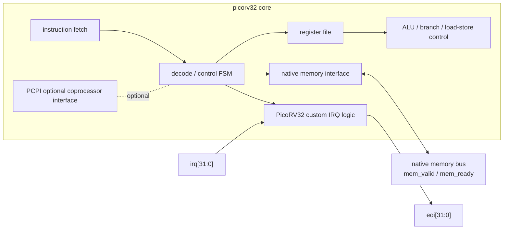
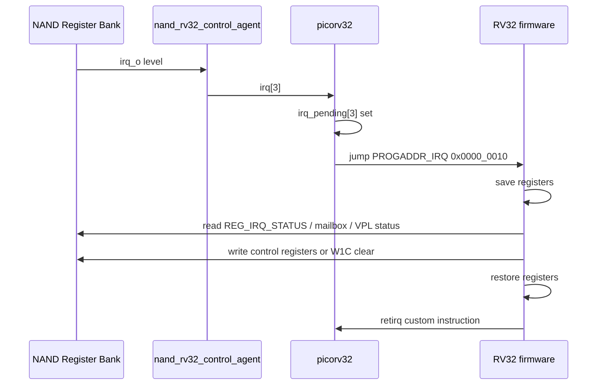
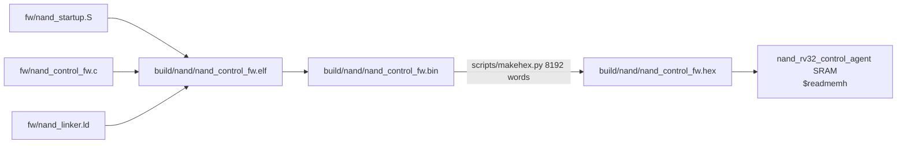

# NAND PicoRV32 Integration
Version: v0.4
Status: active

## 1. 문서 목적과 경계

이 문서는 NAND repo 안에 vendored copy로 포함된 PicoRV32 core를
`nand_rv32_control_agent.v` 안에서 어떻게 붙였는지 설명한다.

전체 NAND model top-level architecture, Decode/Page Buffer/VPL/Register Bank의
상위 연결은 `Architecture.md`가 담당한다. 이 문서는 그 구조를 반복하지 않고,
PicoRV32 core 자체의 interface와 NAND RV32 control-agent 내부 연결만 다룬다.

핵심 질문:

- PicoRV32 core는 어떤 block/interface로 이루어져 있는가?
- 왜 `picorv32` native memory bus를 직접 사용했는가?
- native memory bus를 local FW SRAM과 NAND Register Bank MMIO로 어떻게 decode하는가?
- Register Bank IRQ와 PicoRV32 custom IRQ flow는 어떻게 연결되는가?
- firmware image, stack, memory map, verification command는 어디서 정해지는가?

## 2. 포함 파일

| 파일 | 역할 |
| --- | --- |
| `../nand_model/picorv32.v` | vendored PicoRV32 RV32I core copy |
| `../nand_model/nand_rv32_control_agent.v` | PicoRV32 instance, local FW SRAM, Register Bank MMIO bridge, IRQ/FW-ready glue |
| `../fw/nand_startup.S` | reset/IRQ vector, stack setup, BSS clear, C entry, IRQ save/restore |
| `../fw/picorv32_custom_ops.S` | PicoRV32 `maskirq`/`retirq` custom instruction macro |
| `../fw/nand_control_fw.c` | readable RV32 C control firmware |
| `../fw/nand_linker.ld` | 32 KiB local SRAM firmware image layout |
| `../fw/nand_mmio.h` | Register Bank MMIO base/offset definitions used by C FW |
| `../scripts/makehex.py` | RV32 firmware binary를 `$readmemh` hex로 변환 |
| `../tb/tb_picorv32_core_ez.v` | firmware-free PicoRV32 native-bus smoke TB |

## 3. PicoRV32 Core 개념 구조

`nand_model/picorv32.v`는 upstream PicoRV32 source를 NAND repo 내부에 둔 vendored
copy다. NAND RTL은 core 내부를 수정하지 않고, module `picorv32`의 native memory
bus와 IRQ port를 사용한다.



현재 NAND path에서 사용하는 것은 기본 `picorv32` module이다.

| vendored module | 현재 NAND 사용 여부 | 설명 |
| --- | --- | --- |
| `picorv32` | 사용 | native memory bus를 직접 노출하는 기본 core |
| `picorv32_axi` | 미사용 | native bus를 AXI4-Lite master로 감싼 wrapper |
| `picorv32_axi_adapter` | 미사용 | native memory bus를 AXI4-Lite로 변환 |
| `picorv32_wb` | 미사용 | Wishbone wrapper |
| `picorv32_pcpi_mul`, `picorv32_pcpi_div` | 미사용 | optional PCPI multiplier/divider |

AXI/Wishbone wrapper를 쓰지 않은 이유는 현재 Register Bank가 이미 단순 `cpu_*`
MMIO slot을 제공하고 있고, RV32 control-agent가 local SRAM과 Register Bank window만
작게 decode하면 충분하기 때문이다. AXI interconnect가 필요한 SoC로 옮길 때는
`picorv32_axi` 또는 별도 native-to-AXI bridge를 다시 검토한다.

## 4. Native Memory Bus 계약

PicoRV32 기본 bus는 request/ready 방식이다.

| Signal | Direction | 의미 |
| --- | --- | --- |
| `mem_valid` | core -> agent | memory transaction valid |
| `mem_instr` | core -> agent | instruction fetch access 표시 |
| `mem_ready` | agent -> core | transaction complete |
| `mem_addr[31:0]` | core -> agent | byte address |
| `mem_wdata[31:0]` | core -> agent | write data |
| `mem_wstrb[3:0]` | core -> agent | byte write strobe. `0`이면 read |
| `mem_rdata[31:0]` | agent -> core | read data |

규칙:

- `mem_valid && mem_ready`에서 한 transaction이 완료된다.
- `mem_wstrb == 4'b0000`이면 read다.
- `mem_wstrb != 4'b0000`이면 byte-enable write다.
- core는 memory map을 알지 못한다. 주소 decode와 ready/rdata 생성은
  `nand_rv32_control_agent`가 담당한다.

현재 미사용 interface:

| Interface | 현재 처리 |
| --- | --- |
| `mem_la_*` look-ahead | 연결하지 않음 |
| PCPI | `pcpi_wr=0`, `pcpi_wait=0`, `pcpi_ready=0`로 tie-off |
| trace | 연결하지 않음 |
| `eoi[31:0]` | core에서 나오지만 현재 NAND RTL은 사용하지 않음 |

## 5. NAND RV32 Control-Agent 내부 연결

`nand_rv32_control_agent`는 PicoRV32 core를 NAND Register Bank의 `cpu_*` MMIO slot에
붙이는 작은 SoC wrapper다. 여기서의 "SoC"는 전체 NAND model이 아니라 RV32 control
path 내부만 의미한다.

Agent public interface:

| Signal | Direction | 의미 |
| --- | --- | --- |
| `core_clk`, `core_rst_n` | input | RV32/Register Bank clock/reset domain |
| `enable_i` | input | control-agent selection gate. resetn은 `core_rst_n && enable_i` |
| `irq_i` | input | Register Bank `irq_o`가 들어오는 interrupt level |
| `cpu_valid_o` | output | Register Bank MMIO access valid |
| `cpu_addr_o[31:0]` | output | Register Bank byte address |
| `cpu_wdata_o[31:0]` | output | Register Bank write data |
| `cpu_wstrb_o[3:0]` | output | Register Bank byte write strobe, `0`이면 read |
| `cpu_rdata_i[31:0]` | input | Register Bank read data |
| `cpu_ready_i` | input | Register Bank access complete |
| `fw_ready_o` | output | FW가 IRQ enable 초기화를 끝냈다는 integration-facing indication |
| `trap_o` | output | PicoRV32 trap debug/status |

## 6. Memory Map과 Decode 동작

PicoRV32 core 자체에는 고정 memory map이 없다. 현재 NAND RV32 path의 map은
`nand_rv32_control_agent` parameter와 `fw/nand_linker.ld`, `fw/nand_mmio.h`가 함께
정한다.

| Address range | Decode owner | 동작 |
| --- | --- | --- |
| `0x0000_0000` - `0x0000_7fff` | local FW SRAM | instruction fetch, rodata/data/bss/stack access |
| `0x0200_0000` - `0x0200_0fff` | Register Bank bridge | `cpu_*` MMIO transaction으로 전달 |
| 그 외 | 없음 | 현재 FW는 접근하지 않아야 한다. agent는 ready를 만들지 않아 core가 stall된다 |

기본 parameter:

| Parameter | Default | 의미 |
| --- | --- | --- |
| `REG_BASE` | `32'h0200_0000` | Register Bank MMIO base |
| `SRAM_WORDS` | `8192` | 32 KiB local SRAM |
| `STACKADDR` | `32'h0000_8000` | reset 시 stack pointer 초기값 |
| `FW_HEX_FILE` | `build/nand/nand_control_fw.hex` | `$readmemh` firmware image |

SRAM decode:

- `sram_word_addr = mem_addr[31:2]`
- `sram_sel = !reg_sel && (sram_word_addr < SRAM_WORDS)`
- SRAM read/write는 `mem_valid && sram_sel`에서 1-cycle ready를 만든다.
- `mem_wstrb[n]`에 따라 byte lane별 write를 수행한다.

Register Bank decode:

- `reg_sel = (mem_addr[31:12] == REG_BASE[31:12])`
- RV32 control-agent bridge는 상위 bit decode 기준 4 KiB window를 Register Bank
  `cpu_*` bus로 forward한다.
- 현재 `nand_register_bank.v`가 decode하는 public register map은 `REG_BASE + 0x00`
  부터 `REG_BASE + 0x7c`까지다. 이 범위 밖의 4 KiB window access는 reserved로 보고
  FW가 사용하지 않는다.
- Register Bank가 `cpu_ready_i`를 바로 주지 않으면 agent는 address/write data/strobe를
  latch하고 `cpu_ready_i`가 올 때까지 request를 유지한다.
- Register Bank가 ready를 주면 `reg_ready_q`가 core에 `mem_ready`로 돌아가고,
  read access에서는 `cpu_rdata_i`가 `mem_rdata`로 전달된다.

대표 MMIO 주소:

| Register | Address | 용도 |
| --- | --- | --- |
| `REG_HOST_CMD` | `0x0200_0000` | host command mailbox |
| `REG_HOST_EVENT` | `0x0200_001c` | host event pending/debug view |
| `REG_IRQ_STATUS` | `0x0200_0024` | Register Bank IRQ pending/W1C clear |
| `REG_IRQ_ENABLE` | `0x0200_0028` | FW interrupt enable. non-zero write가 `fw_ready_o`를 set |
| `REG_PAGE_BYTES` | `0x0200_003c` | geometry page byte size |
| `REG_OP_CTRL` | `0x0200_0040` | VPL operation option/opcode snapshot |
| `REG_OP_TRIGGER` | `0x0200_0044` | VPL command start doorbell |
| `REG_OP_STATUS` | `0x0200_0048` | VPL/Page Buffer status |
| `REG_OP_LATENCY` | `0x0200_0054` | optional simulation latency override |
| `REG_READOUT_CTRL` | `0x0200_0058` | Read Output source/mode control |

전체 Register Bank map과 bitfield는 `nand_register_bank.md`가 canonical source다.

## 7. PicoRV32 Parameter 설정

현재 `nand_rv32_control_agent`는 `picorv32`를 아래 설정으로 instance한다.

| Parameter | 값 | 이유 |
| --- | --- | --- |
| `ENABLE_COUNTERS` | `0` | control FW에 cycle/instret CSR 불필요, simulation 단순화 |
| `ENABLE_COUNTERS64` | `0` | 64-bit counter 불필요 |
| `ENABLE_REGS_16_31` | `1` | 일반 RV32I C compiler output을 단순하게 수용 |
| `ENABLE_REGS_DUALPORT` | `1` | 기본 register file behavior 유지 |
| `COMPRESSED_ISA` | `0` | RV32I, firmware build도 `-march=rv32i` |
| `ENABLE_IRQ` | `1` | Register Bank IRQ를 firmware로 전달 |
| `ENABLE_IRQ_QREGS` | `0` | IRQ q-register file 미사용, 일반 register save/restore 사용 |
| `ENABLE_IRQ_TIMER` | `0` | PicoRV32 timer IRQ 미사용 |
| `MASKED_IRQ` | `32'h0000_0000` | mask는 firmware `maskirq`로 제어 |
| `LATCHED_IRQ` | `32'hffff_ffff` | IRQ input을 PicoRV32 pending으로 latch |
| `PROGADDR_RESET` | `32'h0000_0000` | reset vector = SRAM image start |
| `PROGADDR_IRQ` | `32'h0000_0010` | IRQ vector = startup file `.org 0x10` |
| `STACKADDR` | `32'h0000_8000` | 32 KiB SRAM top |

## 8. IRQ / Firmware Entry Flow

PicoRV32 IRQ는 standard RISC-V privileged CSR/CLINT flow가 아니다.
`mie`, `mip`, `mtvec`, `mret`, CLINT timer를 쓰지 않는다. PicoRV32 custom
instruction인 `maskirq`, `retirq`를 사용한다.



FW startup:

1. reset vector `0x0000_0000`에서 `reset_entry`로 jump한다.
2. `sp = __stack_top`으로 stack을 설정한다.
3. `.bss`를 clear한다.
4. `picorv32_maskirq_insn(zero, zero)`로 IRQ mask를 초기화한다.
5. `nand_fw_main()`으로 진입한다.
6. IRQ vector `0x0000_0010`에서는 register save 후 `nand_fw_irq_handler()`를
   호출하고 `picorv32_retirq_insn()`으로 return한다.

`irq_i`는 PicoRV32 `irq[3]`에만 연결한다. `irq[2:0]`과 `irq[31:4]`는 0이다.
`eoi[31:0]`는 현재 사용하지 않는다. IRQ source ownership, pending/W1C clear
정책은 Register Bank가 담당한다.

## 9. FW-ready Gate

RV32 path에서는 firmware가 아직 IRQ enable을 설정하기 전에 host event가 들어오면
초기 event를 놓치거나 pending clear 순서가 꼬일 수 있다. 이를 막기 위해 agent는
아래 write를 관측하면 `fw_ready_o`를 set한다.

```text
REG_IRQ_ENABLE address = REG_BASE + 0x28
condition = Register Bank MMIO write accepted && (write_data[2:0] != 0)
```

`nand_logic_top`은 `fw_ready_o`를 sysclk domain으로 mirror해서 RV32 FW 초기화가 끝나기
전 host-facing ready gate를 닫는다. gate의 top-level 사용 방식은 `Architecture.md`를
따른다.

## 10. Firmware Image Build

RV32 firmware build target:

```text
make fw
```

Build flow:



Toolchain 기본값:

| Make variable | Default |
| --- | --- |
| `RISCV_TOOLCHAIN_PREFIX` | `/tools/riscv/bin/riscv64-unknown-elf-` |
| `RV32_CFLAGS` 핵심 | `-nostdlib -ffreestanding -mabi=ilp32 -march=rv32i -Os` |
| linker script | `fw/nand_linker.ld` |

Firmware는 heap을 사용하지 않는다. `.text`, `.rodata`, `.data`, `.bss`, stack은
`fw/nand_linker.ld`의 32 KiB SRAM region 안에 배치된다.

## 11. 검증 Target

| Target | 검증 범위 |
| --- | --- |
| `make fw` | startup + C FW + linker + hex image generation |
| `make top-rv32` | RV32 control-agent 포함 `nand_logic_top` elaboration |
| `make sim-rv32` | host traffic scenario를 RV32 control-agent path로 실행 |
| `make sim TB=tb_picorv32_core_ez` | firmware/toolchain 없이 vendored `picorv32` native-bus fetch/load/store smoke |

`tb_picorv32_core_ez.v`는 core 단독 native bus sanity check다. NAND Register Bank나
firmware 동작은 `make sim-rv32`에서 확인한다.

## 12. 현재 한계와 주의

- `nand_rv32_control_agent`의 local SRAM은 현재 PoC/simulation firmware image loading
  목적으로 `$readmemh`를 사용한다.
- invalid address는 ready를 만들지 않으므로 firmware가 접근하면 core가 stall된다.
- PicoRV32 IRQ는 standard RISC-V privileged interrupt가 아니므로 firmware에서
  `mret`/`mtvec` 흐름을 쓰면 안 된다.
- `mem_la_*`, PCPI, AXI/Wishbone wrappers는 현재 NAND path에서 사용하지 않는다.
- Register Bank map 자체의 canonical source는 `nand_register_bank.md`다. 이 문서는
  RV32 address decode와 bridge 관점만 설명한다.

## Version History

| Version | Description |
| --- | --- |
| v0.4 | RV32 bridge의 4 KiB forwarding window와 현재 Register Bank public register decode 범위를 구분하고 FW MMIO 대표 주소에 page/latency register를 추가. |
| v0.3 | Makefile alias target 제거에 맞춰 RV32 firmware/elaboration/simulation 실행 명령을 `fw`, `top-rv32`, `sim-rv32`, `sim TB=...`로 갱신. |
| v0.2 | 전체 NAND top diagram 반복을 제거하고 PicoRV32 core 구조, native bus, RV32 control-agent 내부 bridge, memory map, IRQ/FW-ready, firmware build/verification 흐름을 상세화. |
| v0.1 | NAND repo 내부 vendored PicoRV32 core, native bus MMIO bridge, firmware image, IRQ/FW-ready, verification target 계약 최초 작성. |
