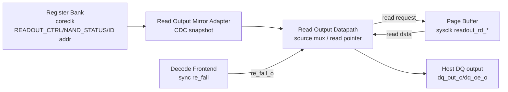
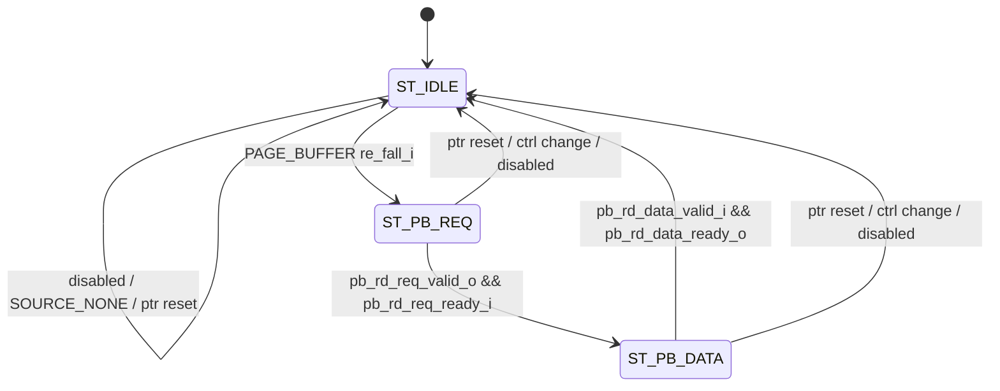

# NAND Read Output Datapath
Version: v0.5
Status: active

## 1. 문서 목적

본 문서는 `nand_model/nand_read_output_datapath.v`의 sysclk-domain read output
계약을 정의한다. 상위 clock/domain 배치와 adapter 역할은 `Architecture.md`와
`nand_adapter_contracts.md`를 따른다. Read output source를 설정하는 MMIO contract는
`nand_register_bank.md`를 따른다.

## 2. 현재 RTL 범위

Read Output Datapath는 host가 `re_n`을 토글할 때 `dq`로 나갈 read byte를 만드는
sysclk-local output path다. FW/control agent는 host command IRQ를 처리한 뒤
Register Bank에 readout source, status, Read ID address를 미리 설정한다. 이 값들은
Read Output Mirror Adapter를 통해 sysclk domain으로 mirror되고, Read Output Datapath는
host `re_n` read cycle에서 coreclk Register Bank transaction을 기다리지 않는다.

현재 RTL은 registered-output hybrid FSM으로 작성한다. 이 방식을 택한 이유는
`re_fall_i`에 대한 현재 read cycle latency를 유지하면서도 host-facing DQ 출력과
Page Buffer handshake를 registered signal로 안정화하기 위해서다. `re_fall_i`,
source selection, Page Buffer ready/valid 같은 입력 event는 next-state/next-output
decision에 사용하고, host로 나가는 `dq_out_o`/`dq_oe_o`와 Page Buffer request/ready는
clock edge에서 register update한다.

여기서 snapshot은 "host read cycle 전에 sysclk domain에 복사되어 안정적으로 보이는
Register Bank 정보"를 뜻한다.

| Snapshot / Data | 원래 owner | sysclk에서 쓰는 이유 |
| --- | --- | --- |
| `readout_ctrl_i` | Register Bank `REG_READOUT_CTRL` | Host `re_n` edge에서 ID, status, Page Buffer data 중 무엇을 출력할지 즉시 결정 |
| `readout_id_addr_i` | Register Bank accepted Read ID address | Read ID `00h`/`20h` style response 선택 |
| `nand_status_i` | Register Bank NAND status view | Read Status `70h` source에서 status byte 반복 출력 |
| Page Buffer data | `nand_page_buffer` sysclk storage | Read Page 결과 byte를 host `dq`로 출력 |

### 2.1 Block Diagram

아래 block diagram은 Read Output Datapath의 주변 연결만 보여준다. Source 선택,
DQ drive/release, read pointer update 같은 cycle-level 규칙은 4장의 동작 규칙을
함께 봐야 한다.

## 3. Interface Contract

| Signal | Direction | Domain | 의미 |
| --- | --- | --- | --- |
| `sys_clk`, `sys_rst_n` | input | sysclk | Read Output Datapath clock/reset |
| `re_fall_i` | input | sysclk | synchronized host `re_n` falling edge pulse |
| `re_rise_i` | input | sysclk | synchronized host `re_n` rising edge pulse |
| `ptr_reset_i` | input | sysclk | read pointer reset pulse |
| `readout_ctrl_i[7:0]` | input | sysclk | mirrored `REG_READOUT_CTRL` snapshot |
| `readout_id_addr_i[7:0]` | input | sysclk | accepted Read ID address snapshot |
| `nand_status_i[7:0]` | input | sysclk | mirrored NAND status byte |
| `pb_rd_req_valid_o`/`pb_rd_req_ready_i` | req | sysclk | Page Buffer read address request |
| `pb_rd_addr_o[12:0]` | output | sysclk | Page Buffer read address |
| `pb_rd_data_valid_i`/`pb_rd_data_ready_o` | rsp | sysclk | Page Buffer read data response |
| `pb_rd_data_i[7:0]` | input | sysclk | Page Buffer read data byte |
| `dq_out_o[7:0]` | output | sysclk | host로 drive할 read byte |
| `dq_oe_o` | output | sysclk | read byte output enable |
| `read_ptr_o[12:0]` | output | sysclk | debug/readout pointer |
| `busy_o` | output | sysclk | Page Buffer read transaction 진행 중 |

`readout_ctrl_i[1:0]`의 source encoding은 `nand_register_bank.md`의
`REG_READOUT_CTRL.SOURCE`를 따른다.

현재 `nand_logic_top` public interface에서는 host data bus가 bidirectional `dq[7:0]`
inout이다. 위 `dq_out_o`/`dq_oe_o`는 Read Output Datapath module의 sysclk-local 내부
drive signal이며, top integration에서 `dq` tri-state drive로 연결된다.

## 4. 동작 규칙

### 4.1 Source Selection

`readout_ctrl_i[2]`는 enable, `readout_ctrl_i[1:0]`은 source다.

| Source | RTL encoding | `re_fall_i` 동작 | Pointer |
| --- | --- | --- | --- |
| `NONE` | `2'd0` | `dq_oe_o=0`, idle 유지 | 증가 없음 |
| `READ_ID` | `2'd1` | `id_byte(readout_id_addr_i, read_ptr_q)`를 `dq_out_o`로 drive | byte마다 증가 |
| `READ_STATUS` | `2'd2` | 현재 `nand_status_i` snapshot을 `dq_out_o`로 drive | 증가 없음 |
| `PAGE_BUFFER` | `2'd3` | Page Buffer read request FSM 시작 | data 수신 후 증가 |

`READ_ID` source에서는 `readout_id_addr_i=20h`이면 `4F 4E 46 49 00 00`
(`ONFI`) sequence를 출력하고, 그 외 주소는 `2C 68 00 00 00 00` sequence를 출력한다.

### 4.2 FSM State

Read Output Datapath는 registered-output hybrid FSM이다. Read ID와 Read Status는
`ST_IDLE`에서 `re_fall_i`를 보고 다음 registered output을 정하고, Page Buffer source는
Page Buffer read request/response handshake가 필요하므로 작은 FSM을 사용한다.

| State | 의미 | 주요 동작 | 다음 상태 |
| --- | --- | --- | --- |
| `ST_IDLE` | `re_fall_i` 대기 | Read ID/Status는 `re_fall_i` cycle의 registered output으로 `dq_out_o`/`dq_oe_o` 갱신. Page Buffer source는 `pb_rd_req_valid_o`와 `pb_rd_addr_o` 생성 | `ST_IDLE` 또는 `ST_PB_REQ` |
| `ST_PB_REQ` | Page Buffer read request accept 대기 | `pb_rd_req_valid_o` 유지, `pb_rd_req_ready_i`를 기다림 | `ST_PB_DATA` |
| `ST_PB_DATA` | Page Buffer data valid 대기 | `pb_rd_data_ready_o=1`, `pb_rd_data_valid_i`가 오면 `dq_out_o` 갱신 | `ST_IDLE` |

### 4.3 DQ Drive / Release

이 절은 FSM state table만으로는 드러나지 않는 host `dq` bus ownership을 설명한다.
Read byte를 drive하는 시점과 bus를 High-Z로 돌려주는 시점이 command/address/data-in
cycle의 bus contention 여부를 결정한다.

| Event | 동작 | 목적 |
| --- | --- | --- |
| `re_fall_i` + Read ID | `dq_out_o`에 ID byte drive, `dq_oe_o=1` | Host Read ID byte 출력 |
| `re_fall_i` + Read Status | `dq_out_o`에 `nand_status_i` drive, `dq_oe_o=1` | Host Read Status byte 출력 |
| Page Buffer data valid | `dq_out_o`에 `pb_rd_data_i` drive, `dq_oe_o=1` | Host Read Page byte 출력 |
| `re_rise_i` | `dq_oe_o=0` | read cycle 이후 DQ bus release |
| disable/source none/reset | `dq_oe_o=0` | command/address/data-in cycle과 bus contention 방지 |

### 4.4 Pointer Reset / Update

이 절은 host가 연속 read cycle을 수행할 때 어떤 byte가 다음에 출력되는지를 설명한다.
Read ID와 Page Buffer read는 byte stream이므로 pointer 규칙이 출력 sequence의 기준이
된다.

| 조건 | 동작 |
| --- | --- |
| `ptr_reset_i=1` | `read_ptr_q=0`, FSM idle, pending Page Buffer request clear |
| `readout_ctrl_i` 변경 | `read_ptr_q=0`, source 변경에 맞춰 새 stream 시작 |
| `readout_id_addr_i` 변경 | `read_ptr_q=0`, Read ID sequence를 새 address 기준으로 시작 |
| Read ID byte 출력 | `read_ptr_q++` |
| Page Buffer byte 출력 | `read_ptr_q++` |
| Read Status byte 출력 | pointer 증가 없음 |

이 block은 `tREA` 같은 analog/absolute timing check를 수행하지 않는다. host TB의
guard timing과 sysclk cycle-level 동작 검증은 별도 testbench가 담당한다.

## 5. 주변 Block과의 관계

| 상대 block | 주고받는 신호 | 언제 | 목적 |
| --- | --- | --- | --- |
| Decode Frontend | `re_fall_i`, `re_rise_i` | Host가 `re_n`을 토글할 때 | DQ drive/release timing 제공 |
| Read Output Mirror Adapter | `readout_ctrl_i`, `readout_id_addr_i`, `nand_status_i`, `ptr_reset_i` | FW/Register Bank가 readout source/status를 설정한 뒤 | coreclk Register Bank snapshot을 sysclk read path로 전달 |
| Page Buffer | `pb_rd_req_*`, `pb_rd_data_*` | Page Buffer source에서 host read byte가 필요할 때 | Read Page data byte를 가져옴 |
| NAND Logic Top | `dq_out_o`, `dq_oe_o` | read byte drive/release 시점 | bidirectional `dq` bus tri-state 제어 |

- Decode Frontend는 synchronized `re_fall_o` pulse를 제공한다. Read Output Datapath는
  command/address decode를 다시 하지 않는다.
- Register Bank는 `REG_READOUT_CTRL`, NAND status, accepted Read ID address를 Read
  Output Mirror Adapter를 통해 sysclk domain으로 mirror한다.
- Page Buffer는 Read Output 전용 `readout_rd_*` port로 byte read를 제공한다. 이 path는
  sysclk-local direct path이며 Page Buffer Adapter/CDC path를 통과하지 않는다.
- Control FW/Surrogate FW는 host command IRQ를 처리한 뒤 readout source를 미리
  설정한다. Host read byte마다 FW가 개입하지 않는다.

## Version History

| Version | Description |
| --- | --- |
| v0.5 | 현재 RTL 범위, snapshot 의미, registered-output hybrid FSM style, source selection, FSM state/transition, DQ drive/release, 주변 block interaction 설명을 보강. |
| v0.4 | 구현 완료 상태에 맞춰 문서 status를 active로 갱신. |
| v0.3 | `dq_out_o`/`dq_oe_o`가 top-level public port가 아니라 bidirectional `dq` 내부 drive signal임을 명시. |
| v0.2 | RE# rising edge에서 `dq_oe_o`를 deassert해 command/address bus contention을 방지하는 계약 추가. |
| v0.1 | Read ID/Status/Page Buffer source mux, RE# edge 기반 output update, Page Buffer readout port 계약 최초 작성. |
