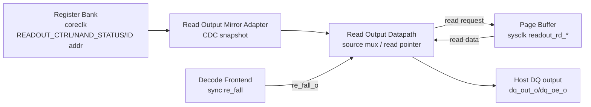

# NAND Read Output Datapath
Version: v0.4
Status: active

## 1. 문서 목적

본 문서는 `nand_model/nand_read_output_datapath.v`의 sysclk-domain read output
계약을 정의한다. 상위 clock/domain 배치와 adapter 역할은 `Architecture.md`와
`nand_adapter_contracts.md`를 따른다. Read output source를 설정하는 MMIO contract는
`nand_register_bank.md`를 따른다.

Read Output Datapath의 목적은 FW/coreclk latency를 host `re_n` to `dq` timing path에
넣지 않고, sysclk domain에 미리 mirror된 source/status/ID snapshot과 Page Buffer
data만 사용해 host read byte를 출력하는 것이다.

## 2. Block Diagram

## 3. Interface Contract

| Signal | Direction | Domain | 의미 |
| --- | --- | --- | --- |
| `sys_clk`, `sys_rst_n` | input | sysclk | Read Output Datapath clock/reset |
| `re_fall_i` | input | sysclk | synchronized host `re_n` falling edge pulse |
| `re_rise_i` | input | sysclk | synchronized host `re_n` rising edge pulse |
| `ptr_reset_i` | input | sysclk | read pointer reset pulse |
| `readout_ctrl_i[7:0]` | input | sysclk | mirrored `REG_READOUT_CTRL` snapshot |
| `readout_id_addr_i[7:0]` | input | sysclk | accepted Read ID address snapshot |
| `nand_status_i[7:0]` | input | sysclk | mirrored NAND status byte |
| `pb_rd_req_valid_o`/`pb_rd_req_ready_i` | req | sysclk | Page Buffer read address request |
| `pb_rd_addr_o[12:0]` | output | sysclk | Page Buffer read address |
| `pb_rd_data_valid_i`/`pb_rd_data_ready_o` | rsp | sysclk | Page Buffer read data response |
| `pb_rd_data_i[7:0]` | input | sysclk | Page Buffer read data byte |
| `dq_out_o[7:0]` | output | sysclk | host로 drive할 read byte |
| `dq_oe_o` | output | sysclk | read byte output enable |
| `read_ptr_o[12:0]` | output | sysclk | debug/readout pointer |
| `busy_o` | output | sysclk | Page Buffer read transaction 진행 중 |

`readout_ctrl_i[1:0]`의 source encoding은 `nand_register_bank.md`의
`REG_READOUT_CTRL.SOURCE`를 따른다.

현재 `nand_logic_top` public interface에서는 host data bus가 bidirectional `dq[7:0]`
inout이다. 위 `dq_out_o`/`dq_oe_o`는 Read Output Datapath module의 sysclk-local 내부
drive signal이며, top integration에서 `dq` tri-state drive로 연결된다.

## 4. 동작 규칙

- `readout_ctrl_i[2] ENABLE=0` 또는 source가 `NONE`이면 `dq_oe_o=0`이다.
- `ptr_reset_i=1`, `readout_ctrl_i` 변경, 또는 Read ID address snapshot 변경 시 read
  pointer를 0으로 되돌린다.
- `READ_ID` source에서는 `readout_id_addr_i=20h`이면 `4F 4E 46 49 00 00`
  (`ONFI`) sequence를 출력하고, 그 외 주소는 `2C 68 00 00 00 00` sequence를
  출력한다.
- `READ_STATUS` source에서는 매 `re_fall_i`마다 현재 `nand_status_i` snapshot을
  `dq_out_o`로 출력한다.
- `PAGE_BUFFER` source에서는 `re_fall_i`마다 Page Buffer read request를 내고,
  response byte가 도착하면 `dq_out_o`를 갱신한 뒤 read pointer를 증가시킨다.
- `re_rise_i=1`이면 `dq_oe_o`를 deassert한다. 따라서 read byte drive는 host read
  cycle 안에만 유지되고, 다음 command/address/data-in cycle에서는 Host가 DQ를
  drive할 수 있다.
- 이 block은 `tREA` 같은 analog/absolute timing check를 수행하지 않는다. host TB의
  guard timing과 sysclk cycle-level 동작 검증은 별도 testbench가 담당한다.

## 5. 주변 Block과의 관계

- Decode Frontend는 synchronized `re_fall_o` pulse를 제공한다. Read Output Datapath는
  command/address decode를 다시 하지 않는다.
- Register Bank는 `REG_READOUT_CTRL`, NAND status, accepted Read ID address를 Read
  Output Mirror Adapter를 통해 sysclk domain으로 mirror한다.
- Page Buffer는 Read Output 전용 `readout_rd_*` port로 byte read를 제공한다. 이 path는
  sysclk-local direct path이며 Page Buffer Adapter/CDC path를 통과하지 않는다.
- Control FW/Surrogate FW는 host command IRQ를 처리한 뒤 readout source를 미리
  설정한다. Host read byte마다 FW가 개입하지 않는다.

## Version History

| Version | Description |
| --- | --- |
| v0.4 | 구현 완료 상태에 맞춰 문서 status를 active로 갱신. |
| v0.3 | `dq_out_o`/`dq_oe_o`가 top-level public port가 아니라 bidirectional `dq` 내부 drive signal임을 명시. |
| v0.2 | RE# rising edge에서 `dq_oe_o`를 deassert해 command/address bus contention을 방지하는 계약 추가. |
| v0.1 | Read ID/Status/Page Buffer source mux, RE# edge 기반 output update, Page Buffer readout port 계약 최초 작성. |
